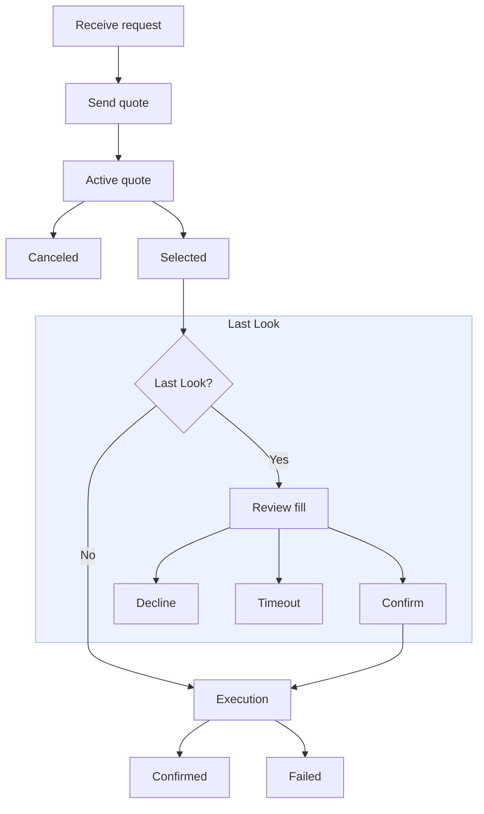

> ## Documentation Index
> Fetch the complete documentation index at: https://docs.polymarket.com/llms.txt
> Use this file to discover all available pages before exploring further.

# 做市商

> 构建用于定价和执行 Combos 的做市商集成

本指南介绍做市商如何处理 Combo RFQ。你将打开报价会话、响应传入的请求、在需要时取消已提交的报价、通过 Last Look 确认成交，并监控执行更新。

<Note>
  如需了解 Combos 做市功能的开发动态，请加入 [Combos 做市商 Telegram
  群组](https://t.me/+eyMtdtKasWZjYTMx)。
</Note>

## 开始报价

首先，准备一个通过 RFQ 系统身份验证的报价会话。你需要一个 Polymarket 账户；可在 [polymarket.com](https://polymarket.com) 创建。

<Tabs>
  <Tab title="TypeScript">
    <Steps>
      <Step title="安装包">
        使用你选择的包管理器安装统一 TypeScript SDK。

        <CodeGroup>
          ```bash pnpm theme={null}
          pnpm add @polymarket/client@latest viem
          ```

          ```bash npm theme={null}
          npm install @polymarket/client@latest viem
          ```

          ```bash yarn theme={null}
          yarn add @polymarket/client@latest viem
          ```
        </CodeGroup>

        <Note>
          本页使用 Viem 进行钱包签名。如需使用其他钱包库，请参阅 [TypeScript
          工具指南](/cn/getting-started/typescript#wallet-integrations)。
        </Note>
      </Step>

      <Step title="创建安全客户端">
        使用一个具备用户请求成交所需资金的钱包及其签名者信息创建 `SecureClient`。

        ```ts theme={null}
        import { createSecureClient, relayerApiKey } from "@polymarket/client";
        import { privateKey } from "@polymarket/client/viem";

        const client = await createSecureClient({
          wallet: process.env.POLYMARKET_WALLET_ADDRESS!,
          signer: privateKey(process.env.PRIVATE_KEY!),
          apiKey: relayerApiKey({
            key: process.env.RELAYER_API_KEY!,
            address: process.env.RELAYER_API_KEY_ADDRESS!,
          }),
        });
        ```

        下一步设置交易授权时需要 Relayer API 密钥。请前往 polymarket.com → Settings → API Keys 创建 [Relayer API 密钥](https://polymarket.com/settings?tab=api-keys)。
      </Step>

      <Step title="设置交易授权">
        设置满足用户请求所需的授权。

        ```ts theme={null}
        await client.setupTradingApprovals();
        ```
      </Step>

      <Step title="打开 RFQ 会话">
        打开 RFQ 会话。

        ```ts theme={null}
        const session = await client.openRfqSession();

        for await (const event of session) {
          // event: RfqEvent
        }
        ```
      </Step>

      <Step title="关闭会话">
        你可以随时调用 `session.close()` 关闭会话。

        ```ts theme={null}
        for await (const event of session) {
          if (shouldCloseSession) {
            await session.close();
            break;
          }

          // …
        }
        ```
      </Step>
    </Steps>
  </Tab>

  <Tab title="Python">
    <Steps>
      <Step title="安装包">
        使用你选择的包管理器安装 Python SDK。

        <CodeGroup>
          ```bash uv theme={null}
          uv add polymarket-client
          ```

          ```bash pip theme={null}
          pip install polymarket-client
          ```

          ```bash poetry theme={null}
          poetry add polymarket-client
          ```
        </CodeGroup>
      </Step>

      <Step title="创建安全客户端">
        使用一个具备用户请求成交所需资金的钱包及其签名者信息创建 `AsyncSecureClient`。

        ```python theme={null}
        import os

        from polymarket import AsyncSecureClient, RelayerApiKey


        client = await AsyncSecureClient.create(
            private_key=os.environ["PRIVATE_KEY"],
            wallet=os.environ["POLYMARKET_WALLET_ADDRESS"],
            api_key=RelayerApiKey(
                key=os.environ["RELAYER_API_KEY"],
                address=os.environ["RELAYER_API_KEY_ADDRESS"],
            ),
        )
        ```

        下一步设置交易授权时需要 Relayer API 密钥。请前往 polymarket.com → Settings → API Keys 创建 [Relayer API 密钥](https://polymarket.com/settings?tab=api-keys)。
      </Step>

      <Step title="设置交易授权">
        设置满足用户请求所需的授权。

        ```python theme={null}
        await client.setup_trading_approvals()
        ```
      </Step>

      <Step title="打开 RFQ 会话">
        打开 RFQ 会话。

        ```python theme={null}
        async with client.open_rfq_session() as session:
            async for event in session:
                # event: RfqEvent
                ...
        ```
      </Step>

      <Step title="关闭会话">
        你可以随时调用 `await session.close()` 关闭会话。

        ```python theme={null}
        async with client.open_rfq_session() as session:
            async for event in session:
                if should_close_session:
                    await session.close()
                    break

                ...
        ```
      </Step>
    </Steps>
  </Tab>

  <Tab title="API">
    <Note>
      使用 Polygon 主网链 ID `137` 进行 CLOB 身份验证和 Exchange v3 订单签名。
    </Note>

    <Steps>
      <Step title="打开 WebSocket">
        连接 RFQ 系统 WebSocket。

        ```text theme={null}
        wss://combos-rfq-gateway-quoter.polymarket.com/ws/rfq
        ```

        在开始集成前检查数据流：

        ```bash theme={null}
        wscat -c "wss://combos-rfq-gateway-quoter.polymarket.com/ws/rfq"
        ```

        部分写入操作也可通过 REST API 完成。

        ```text theme={null}
        https://combos-rfq-api.polymarket.com
        ```
      </Step>

      <Step title="获取 CLOB 凭证">
        RFQ WebSocket 身份验证使用 CLOB API 凭证：API 密钥、secret 和 passphrase。如果尚无凭证，请先参阅 [获取 API 凭证](/cn/getting-started/api#authentication)。
      </Step>

      <Step title="确定报价方身份">
        发送 `auth` 前，先确定订单签名者身份。RFQ 系统需要订单签名地址、为订单提供资金的钱包地址，以及关联这两个地址的签名类型。

        | 钱包类型           | `signature_type` | `signer_address`  | `maker_address` |
        | -------------- | ---------------- | ----------------- | --------------- |
        | Deposit Wallet | `3` POLY\_1271   | Deposit Wallet 地址 | Deposit Wallet  |
        | Safe Wallet    | `2` Safe         | 经过身份验证的签名地址       | 派生的 Safe 钱包     |
        | Proxy Wallet   | `1` Proxy        | 经过身份验证的签名地址       | 派生的 Proxy 钱包    |
        | EOA            | `0` EOA          | EOA 地址            | 相同的 EOA 地址      |

        有关详情，请参阅 [钱包和身份验证](/cn/trading/wallets-auth#wallet-types)。
      </Step>

      <Step title="身份验证">
        请在 30 秒内将 `auth` 作为第一条 WebSocket 消息发送。消息中需包含 CLOB 凭证，以及上一步确定的 `signer_address`、`maker_address` 和 `signature_type` 值。此示例使用 Deposit Wallet。

        ```json theme={null}
        {
          "type": "auth",
          "auth": {
            "apiKey": "YOUR_API_KEY",
            "secret": "YOUR_API_SECRET",
            "passphrase": "YOUR_API_PASSPHRASE"
          },
          "identity": {
            "signer_address": "<signer_address>",
            "maker_address": "<maker_address>",
            "signature_type": 3 // <signature_type>
          }
        }
        ```

        身份验证会返回成功或失败响应。

        <CodeGroup>
          ```json Success theme={null}
          {
            "type": "auth",
            "success": true,
            "address": "0xAuthenticatedAddress",
            "role": "maker"
          }
          ```

          ```json Failure theme={null}
          {
            "type": "auth",
            "success": false,
            "error": "unauthenticated"
          }
          ```
        </CodeGroup>

        <Note>
          RFQ 系统使用 WebSocket 协议心跳帧保持连接。它每 30 秒发送一个 payload 为 `rfq`
          的 ping 帧；客户端必须返回带有相同 payload 的 pong 帧。大多数 WebSocket
          客户端会自动处理。这些是协议帧，而非 RFQ 事件流中的 JSON 消息。若 2
          分钟内未收到入站消息或 pong，网关会关闭失效连接。
        </Note>
      </Step>

      <Step title="检查授权要求">
        提交报价或管理 Combo 库存前，`maker_address` 必须授权可能转移其资产的合约。

        | 授权                          | 需要授权的情况                | 合约调用                                                    |
        | --------------------------- | ---------------------- | ------------------------------------------------------- |
        | pUSD 抵押品                    | 报价订单转移 pUSD            | `CollateralToken.approve(ExchangeV3, maxUint256)`       |
        | Combo 持仓                    | 报价订单转移 Combo 持仓        | `PositionManager.setApprovalForAll(ExchangeV3, true)`   |
        | Router pUSD 抵押品             | 通过 Router 将 pUSD 拆分为持仓 | `CollateralToken.approve(Router, maxUint256)`           |
        | Router 持仓                   | 通过 Router 管理或赎回持仓      | `PositionManager.setApprovalForAll(Router, true)`       |
        | AutoRedeemer Combo operator | 希望自动赎回流程使用它            | `PositionManager.setApprovalForAll(AutoRedeemer, true)` |

        使用以下合约地址构建授权调用。

        | 合约              | 地址                                           |
        | --------------- | -------------------------------------------- |
        | pUSD 抵押品 token  | `0xC011a7E12a19f7B1f670d46F03B03f3342E82DFB` |
        | Exchange v3     | `0xe3333700cA9d93003F00f0F71f8515005F6c00Aa` |
        | Router          | `0x12121212006e4CD160D18e3f00711DA5c3372600` |
        | PositionManager | `0x006F54F7f9A22e0000CC2AB60031000000ae9fEF` |
        | AutoRedeemer    | `0xa1200000d0002264C9a1698e001292D00E1b00af` |

        <Note>
          以下步骤使用 Deposit Wallet 的[无 gas
          交易流程](/cn/trading/wallets-auth#execute-gasless-transactions)。如果使用 EOA
          交易，请直接从 `maker_address` 提交授权。Safe 或 Proxy Wallet 流程请使用 SDK。
        </Note>
      </Step>

      <Step title="构建授权调用列表">
        对尚未设置的授权调用进行编码。

        <CodeGroup>
          ```solidity ERC-20 Approval theme={null}
          function approve(address spender, uint256 amount) returns (bool);
          ```

          ```solidity ERC-1155 Approval theme={null}
          function setApprovalForAll(address operator, bool approved);
          ```
        </CodeGroup>

        根据已编码的 calldata 构建 relayer 调用列表。

        ```json theme={null}
        [
          {
            "target": "0xC011a7E12a19f7B1f670d46F03B03f3342E82DFB",
            "value": "0",
            "data": "<approve_exchange_v3_calldata>"
          },
          {
            "target": "0xC011a7E12a19f7B1f670d46F03B03f3342E82DFB",
            "value": "0",
            "data": "<approve_router_calldata>"
          },
          {
            "target": "0x006F54F7f9A22e0000CC2AB60031000000ae9fEF",
            "value": "0",
            "data": "<approve_exchange_v3_operator_calldata>"
          },
          {
            "target": "0x006F54F7f9A22e0000CC2AB60031000000ae9fEF",
            "value": "0",
            "data": "<approve_router_operator_calldata>"
          },
          {
            "target": "0x006F54F7f9A22e0000CC2AB60031000000ae9fEF",
            "value": "0",
            "data": "<approve_auto_redeemer_operator_calldata>"
          }
        ]
        ```
      </Step>

      <Step title="获取 Nonce">
        签署批次前获取一个新的 `WALLET` nonce。

        ```bash theme={null}
        curl -G "https://relayer-v2.polymarket.com/v1/account/transactions/params" \
          -H "RELAYER_API_KEY: $RELAYER_API_KEY" \
          -H "RELAYER_API_KEY_ADDRESS: $RELAYER_API_KEY_ADDRESS" \
          --data-urlencode "address=$RELAYER_API_KEY_ADDRESS" \
          --data-urlencode "type=WALLET"
        ```

        响应中包含随交易签署的 nonce。

        ```json theme={null}
        {
          "address": "<RELAYER_API_KEY_ADDRESS>",
          "nonce": "<wallet_nonce>"
        }
        ```
      </Step>

      <Step title="提交交易">
        使用所有者构建并签署 Deposit Wallet `Batch`。将调用列表步骤中的授权调用作为 `calls`。

        ```json EIP-712 Batch theme={null}
        {
          "domain": {
            "name": "DepositWallet",
            "version": "1",
            "chainId": 137,
            "verifyingContract": "<maker_address>"
          },
          "types": {
            "Call": [
              { "name": "target", "type": "address" },
              { "name": "value", "type": "uint256" },
              { "name": "data", "type": "bytes" }
            ],
            "Batch": [
              { "name": "wallet", "type": "address" },
              { "name": "nonce", "type": "uint256" },
              { "name": "deadline", "type": "uint256" },
              { "name": "calls", "type": "Call[]" }
            ]
          },
          "primaryType": "Batch",
          "message": {
            "wallet": "<maker_address>",
            "nonce": "<wallet_nonce>",
            "deadline": "<unix_seconds>",
            "calls": [
              {
                "target": "0xC011a7E12a19f7B1f670d46F03B03f3342E82DFB",
                "value": "0",
                "data": "<approval_calldata>"
              }
            ]
          }
        }
        ```

        将已签名批次提交到 relayer。

        ```bash theme={null}
        curl -X POST "https://relayer-v2.polymarket.com/submit" \
          -H "Content-Type: application/json" \
          -H "RELAYER_API_KEY: $RELAYER_API_KEY" \
          -H "RELAYER_API_KEY_ADDRESS: $RELAYER_API_KEY_ADDRESS" \
          -d '{
            "type": "WALLET",
            "from": "<relayer_api_key_address>",
            "to": "0x00000000000Fb5C9ADea0298D729A0CB3823Cc07",
            "nonce": "<wallet_nonce>",
            "signature": "<wallet_batch_signature>",
            "metadata": "Approve Combo RFQ contracts",
            "depositWalletParams": {
              "depositWallet": "<maker_address>",
              "deadline": "<unix_seconds>",
              "calls": [
                {
                  "target": "0xC011a7E12a19f7B1f670d46F03B03f3342E82DFB",
                  "value": "0",
                  "data": "<approval_calldata>"
                }
              ]
            }
          }'
        ```

        响应中包含 relayer 交易 ID。

        ```json theme={null}
        {
          "transactionID": "<transaction_id>",
          "state": "STATE_NEW"
        }
        ```
      </Step>

      <Step title="轮询交易">
        在提交依赖这些授权的报价前，轮询 relayer 交易，直至其达到 `STATE_CONFIRMED`。

        ```bash theme={null}
        curl "https://relayer-v2.polymarket.com/v1/account/transactions/<transaction_id>" \
          -H "RELAYER_API_KEY: $RELAYER_API_KEY" \
          -H "RELAYER_API_KEY_ADDRESS: $RELAYER_API_KEY_ADDRESS"
        ```

        ```json theme={null}
        {
          "transaction_id": "<transaction_id>",
          "transaction_hash": "<transaction_hash>",
          "state": "STATE_CONFIRMED",
          "error_msg": null
        }
        ```

        将 `STATE_FAILED` 和 `STATE_INVALID` 视为终止失败状态。
      </Step>
    </Steps>
  </Tab>
</Tabs>

## 处理报价请求

报价请求描述用户买入或卖出由一组给定腿定义的 Combo 份额的意图。目前，报价请求只能买入或卖出 Combo 的 YES 侧。

下列情况展示做市商如何使用抵押品或库存满足用户的买入或卖出请求。

| 报价请求   | 使用抵押品               | 使用库存                |
| ------ | ------------------- | ------------------- |
| 买入 YES | 以 `1 - price` 买入 NO | 以 `price` 卖出 YES    |
| 卖出 YES | 以 `price` 买入 YES    | 以 `1 - price` 卖出 NO |

有关 YES/NO 持仓模型的详情，请参阅[组合持仓](/cn/trading/positions/combinatorial)。

下图展示做市商侧的报价生命周期，从接收报价请求到最终结果。



### 授权报价

通过为请求定价并向 RFQ 系统返回已签名订单来授权每个报价。报价方应在 **400 毫秒**的提交窗口内响应。

<Tabs>
  <Tab title="TypeScript">
    <Steps>
      <Step title="根据事件类型分支">
        首先，根据 `event.type` 分支处理会话流中的报价请求。

        ```ts theme={null}
        switch (event.type) {
          case "quote_request":
            // event: RfqQuoteRequestEvent
            void handleQuoteRequest(event);
            break;

          // …
        }
        ```
      </Step>

      <Step title="评估请求">
        然后，在定价前检查 `RfqQuoteRequestEvent`。

        | 字段                   | 类型                     | 说明                        |
        | -------------------- | ---------------------- | ------------------------- |
        | `rfqId`              | `RfqId`                | 用于关联响应的 RFQ 标识符           |
        | `requestorPublicId`  | `RfqRequestorPublicId` | 用户请求的公开标识符                |
        | `conditionId`        | `ComboConditionId`     | 派生的 Combo condition ID    |
        | `direction`          | `RfqDirection`         | 用户想买入还是卖出                 |
        | `side`               | `RfqSide.Yes`          | 目前始终为 `RfqSide.Yes`       |
        | `requestedSize`      | `RfqRequestedSize`     | 用户请求的名义金额或份额规模            |
        | `yesPositionId`      | `PositionId`           | 派生的 YES Combo position ID |
        | `noPositionId`       | `PositionId`           | 派生的 NO Combo position ID  |
        | `legPositionIds`     | `PositionId[]`         | 底层腿 position ID           |
        | `submissionDeadline` | `EpochMilliseconds`    | Unix 毫秒报价提交截止时间           |

        `requestedSize` 是一个 `RfqRequestedSize` 值，用于描述用户如何指定请求规模。

        ```ts theme={null}
        type RfqRequestedSize =
          | {
              unit: RfqRequestedSizeUnit.Notional;
              value: DecimalString;
            }
          | {
              unit: RfqRequestedSizeUnit.Shares;
              value: DecimalString;
            };
        ```

        其中：

        * `notional`：以抵押品货币计价的请求目标价值。例如，`"3"` 表示用户希望购买价值约 3 pUSD 的 Combo，最终份额数量由报价价格推导。`notional` 始终且仅由 BUY 请求使用。
        * `shares`：Combo 结果 token 的目标数量。例如，`"10"` 表示用户希望购买 10 份，即 10,000,000 个基础单位。`shares` 始终且仅由 SELL 请求使用。

        在两种情况下，`value` 都是规范化的十进制字符串。
      </Step>

      <Step title="提交">
        最后，在会话循环外处理定价、报价提交和持久化，并确保在 `event.submissionDeadline` 截止时间前完成。请求价格以每份 YES Combo 的 pUSD 表示；例如，`0.45` 表示每份 `0.45` pUSD。如果不想为该请求报价，请跳过提交。

        ```ts theme={null}
        async function handleQuoteRequest(event: RfqQuoteRequestEvent) {
          const price = priceComboRequest(event);

          if (price === undefined) return;

          const reference = await event.quote({ price });

          storeQuoteReference(reference);
        }
        ```
      </Step>
    </Steps>
  </Tab>

  <Tab title="Python">
    <Steps>
      <Step title="检查事件类型">
        首先，使用 `isinstance(...)` 处理会话流中的报价请求。

        ```python theme={null}
        from polymarket import RfqQuoteRequestEvent


        async for event in session:
            if isinstance(event, RfqQuoteRequestEvent):
                await handle_quote_request(event)
        ```
      </Step>

      <Step title="评估请求">
        然后，在定价前检查 `RfqQuoteRequestEvent`。

        | 字段                    | 类型                       | 说明                        |
        | --------------------- | ------------------------ | ------------------------- |
        | `rfq_id`              | `RfqId`                  | 用于关联响应的 RFQ 标识符           |
        | `requestor_public_id` | `RfqRequestorPublicId`   | 用户请求的公开标识符                |
        | `condition_id`        | `ComboConditionId`       | 派生的 Combo condition ID    |
        | `direction`           | `RfqDirection`           | 用户想买入还是卖出                 |
        | `side`                | `RfqSide`                | 目前始终为 `RfqSide.YES`       |
        | `requested_size`      | `RfqRequestedSize`       | 用户请求的名义金额或份额规模            |
        | `yes_position_id`     | `PositionId`             | 派生的 YES Combo position ID |
        | `no_position_id`      | `PositionId`             | 派生的 NO Combo position ID  |
        | `leg_position_ids`    | `tuple[PositionId, ...]` | 底层腿 position ID           |
        | `submission_deadline` | `int`                    | Unix 毫秒报价提交截止时间           |

        `requested_size` 是一个 `RfqRequestedSize` 值，用于描述用户如何指定请求规模。

        ```python theme={null}
        from dataclasses import dataclass
        from decimal import Decimal

        from polymarket import RfqRequestedSizeUnit


        @dataclass(frozen=True, slots=True, kw_only=True)
        class RfqRequestedSize:
            unit: RfqRequestedSizeUnit
            value: Decimal
        ```

        其中：

        * `RfqRequestedSizeUnit.NOTIONAL`：以抵押品货币计价的请求目标价值。例如，`Decimal("3")` 表示用户希望购买价值约 3 pUSD 的 Combo，最终份额数量由报价价格推导。BUY RFQ 始终使用 `NOTIONAL`。
        * `RfqRequestedSizeUnit.SHARES`：Combo 结果 token 的目标数量。例如，`Decimal("10")` 表示用户希望卖出 10 份，即 10,000,000 个基础单位。SELL RFQ 始终使用 `SHARES`。

        在两种情况下，`value` 都是 `Decimal`。
      </Step>

      <Step title="提交">
        最后，在会话循环外处理定价、报价提交和持久化，并确保在 `event.submission_deadline` 截止时间前完成。请求价格以每份 YES Combo 的 pUSD 表示；例如，`Decimal("0.45")` 表示每份 `0.45` pUSD。如果不想为该请求报价，请跳过提交。

        ```python theme={null}
        from decimal import Decimal

        from polymarket import RfqQuoteRequestEvent


        async def handle_quote_request(event: RfqQuoteRequestEvent) -> None:
            price = price_combo_request(event)

            if price is None:
                return

            reference = await event.quote(price=price)

            store_quote_reference(reference)
        ```
      </Step>
    </Steps>
  </Tab>

  <Tab title="API">
    <Steps>
      <Step title="接收报价请求">
        RFQ 系统通过经过身份验证的 WebSocket 发送 `RFQ_REQUEST` 消息。请在定价前检查请求。

        <CodeGroup>
          ```json Notional Request theme={null}
          {
            "type": "RFQ_REQUEST",
            "rfq_id": "<rfq_id>",
            "requestor_public_id": "<requestor_public_id>",
            "leg_position_ids": ["<leg_position_id_1>", "<leg_position_id_2>"],
            "condition_id": "<condition_id>",
            "yes_position_id": "<yes_position_id>",
            "no_position_id": "<no_position_id>",
            "direction": "BUY",
            "side": "YES",
            "requested_size": {
              "unit": "notional",
              "value_e6": "1000000"
            },
            "submission_deadline": "<unix_milliseconds>"
          }
          ```

          ```json Shares Request theme={null}
          {
            "type": "RFQ_REQUEST",
            "rfq_id": "<rfq_id>",
            "requestor_public_id": "<requestor_public_id>",
            "leg_position_ids": ["<leg_position_id_1>", "<leg_position_id_2>"],
            "condition_id": "<condition_id>",
            "yes_position_id": "<yes_position_id>",
            "no_position_id": "<no_position_id>",
            "direction": "SELL",
            "side": "YES",
            "requested_size": {
              "unit": "shares",
              "value_e6": "1000000"
            },
            "submission_deadline": "<unix_milliseconds>"
          }
          ```
        </CodeGroup>

        `BUY` 请求始终使用 `notional` 规模，它指定目标 pUSD 金额，并根据报价价格推导可成交份额数量。`SELL` 请求始终使用 `shares` 规模，它指定要卖出的 Combo 结果 token 的确切数量。
      </Step>

      <Step title="构建订单">
        确定一整份的基础单位价格 `price`。一整份等于 `1000000` 个份额基础单位，`1` pUSD 等于 `1000000` 个 pUSD 基础单位。例如，每份 `0.45` pUSD 表示 `price = 450000`。

        根据请求确定 `size`：

        | `requested_size.unit` | `size`                                             |
        | --------------------- | -------------------------------------------------- |
        | `notional`            | `floor(requested_size.value_e6 * 1000000 / price)` |
        | `shares`              | `requested_size.value_e6`                          |

        然后确定订单 token 和金额：

        | 报价请求       | Token             | `makerAmount`                              | `takerAmount` |
        | ---------- | ----------------- | ------------------------------------------ | ------------- |
        | `SELL` YES | `yes_position_id` | `ceil(price * size / 1000000)`             | `size`        |
        | `BUY` YES  | `no_position_id`  | `ceil((1000000 - price) * size / 1000000)` | `size`        |

        以下示例报价 `1` 份，因此 `size = 1000000`。

        <CodeGroup>
          ```json SELL Request theme={null}
          {
            "salt": "<order_salt>",
            "maker": "<maker_address>",
            "signer": "<signer_address>",
            "tokenId": "<yes_position_id>",
            "makerAmount": "450000",
            "takerAmount": "1000000",
            "side": 0,
            "signatureType": 3, // <signature_type>
            "timestamp": "<unix_seconds>",
            "metadata": "0x0000000000000000000000000000000000000000000000000000000000000000",
            "builder": "0x0000000000000000000000000000000000000000000000000000000000000000"
          }
          ```

          ```json BUY Request theme={null}
          {
            "salt": "<order_salt>",
            "maker": "<maker_address>",
            "signer": "<signer_address>",
            "tokenId": "<no_position_id>",
            "makerAmount": "550000",
            "takerAmount": "1000000",
            "side": 0,
            "signatureType": 3, // <signature_type>
            "timestamp": "<unix_seconds>",
            "metadata": "0x0000000000000000000000000000000000000000000000000000000000000000",
            "builder": "0x0000000000000000000000000000000000000000000000000000000000000000"
          }
          ```
        </CodeGroup>
      </Step>

      <Step title="构建 EIP-712 类型化数据">
        为你的钱包类型构建 EIP-712 类型化数据 payload：

        * 当 `signature_type` 为 `3` 时，使用 `depositWalletTypedData`。
        * 当 `signature_type` 为 `0`、`1` 或 `2` 时，使用 `exchangeV3OrderTypedData`。

        <CodeGroup>
          ```json depositWalletTypedData theme={null}
          {
            "domain": {
              "name": "Polymarket CTF Exchange",
              "version": "3",
              "chainId": 137,
              "verifyingContract": "0xe3333700cA9d93003F00f0F71f8515005F6c00Aa"
            },
            "types": {
              "Order": [
                { "name": "salt", "type": "uint256" },
                { "name": "maker", "type": "address" },
                { "name": "signer", "type": "address" },
                { "name": "tokenId", "type": "uint256" },
                { "name": "makerAmount", "type": "uint256" },
                { "name": "takerAmount", "type": "uint256" },
                { "name": "side", "type": "uint8" },
                { "name": "signatureType", "type": "uint8" },
                { "name": "timestamp", "type": "uint256" },
                { "name": "metadata", "type": "bytes32" },
                { "name": "builder", "type": "bytes32" }
              ],
              "TypedDataSign": [
                { "name": "contents", "type": "Order" },
                { "name": "name", "type": "string" },
                { "name": "version", "type": "string" },
                { "name": "chainId", "type": "uint256" },
                { "name": "verifyingContract", "type": "address" },
                { "name": "salt", "type": "bytes32" }
              ]
            },
            "primaryType": "TypedDataSign",
            "message": {
              "contents": {
                "salt": "<order_salt>",
                "maker": "<maker_address>",
                "signer": "<signer_address>",
                "tokenId": "<yes_position_id>",
                "makerAmount": "450000",
                "takerAmount": "1000000",
                "side": 0,
                "signatureType": 3, // <signature_type>
                "timestamp": "<unix_seconds>",
                "metadata": "0x0000000000000000000000000000000000000000000000000000000000000000",
                "builder": "0x0000000000000000000000000000000000000000000000000000000000000000"
              },
              "name": "DepositWallet",
              "version": "1",
              "chainId": 137,
              "verifyingContract": "0xYourDepositWallet",
              "salt": "0x0000000000000000000000000000000000000000000000000000000000000000"
            }
          }
          ```

          ```json exchangeV3OrderTypedData theme={null}
          {
            "domain": {
              "name": "Polymarket CTF Exchange",
              "version": "3",
              "chainId": 137,
              "verifyingContract": "0xe3333700cA9d93003F00f0F71f8515005F6c00Aa"
            },
            "types": {
              "EIP712Domain": [
                { "name": "name", "type": "string" },
                { "name": "version", "type": "string" },
                { "name": "chainId", "type": "uint256" },
                { "name": "verifyingContract", "type": "address" }
              ],
              "Order": [
                { "name": "salt", "type": "uint256" },
                { "name": "maker", "type": "address" },
                { "name": "signer", "type": "address" },
                { "name": "tokenId", "type": "uint256" },
                { "name": "makerAmount", "type": "uint256" },
                { "name": "takerAmount", "type": "uint256" },
                { "name": "side", "type": "uint8" },
                { "name": "signatureType", "type": "uint8" },
                { "name": "timestamp", "type": "uint256" },
                { "name": "metadata", "type": "bytes32" },
                { "name": "builder", "type": "bytes32" }
              ]
            },
            "primaryType": "Order",
            "message": {
              "salt": "<order_salt>",
              "maker": "0xYourEoaAddress",
              "signer": "0xYourEoaAddress",
              "tokenId": "<yes_position_id>",
              "makerAmount": "450000",
              "takerAmount": "1000000",
              "side": 0,
              "signatureType": 0, // <signature_type>
              "timestamp": "<unix_seconds>",
              "metadata": "0x0000000000000000000000000000000000000000000000000000000000000000",
              "builder": "0x0000000000000000000000000000000000000000000000000000000000000000"
            }
          }
          ```
        </CodeGroup>

        两个 payload 均使用 Exchange v3 EIP-712 domain。`exchangeV3OrderTypedData` 是直接的 Exchange v3 `Order` payload。`depositWalletTypedData` 是一个 `TypedDataSign` 包装器，其 `contents` 字段为 Exchange v3 订单，消息中还包含 Deposit Wallet 验证字段。
      </Step>

      <Step title="签署订单">
        为通过身份验证的钱包类型签署类型化数据 payload。普通 Exchange v3 payload 与 Deposit Wallet payload 不同：

        | 钱包类型           | `signatureType` | 待签名 Payload                | `signed_order.signature` |
        | -------------- | --------------- | -------------------------- | ------------------------ |
        | Deposit Wallet | `3`             | `depositWalletTypedData`   | ERC-7739 包装签名            |
        | Safe Wallet    | `2`             | `exchangeV3OrderTypedData` | 标准 65 字节 EVM 签名          |
        | Proxy Wallet   | `1`             | `exchangeV3OrderTypedData` | 标准 65 字节 EVM 签名          |
        | EOA            | `0`             | `exchangeV3OrderTypedData` | 标准 65 字节 EVM 签名          |

        以下示例展示如何使用 Viem 为两种签名路径生成 `signature`。

        <CodeGroup>
          ```ts sign.ts theme={null}
          import { privateKeyToAccount } from "viem/accounts";
          import { wrapDepositWalletSignature } from "./wrapDepositWalletSignature";

          const signer = privateKeyToAccount("<SIGNER_PRIVATE_KEY>");

          const signature =
            signatureType === 3
              ? wrapDepositWalletSignature(
                  await signer.signTypedData(depositWalletTypedData),
                  depositWalletTypedData,
                )
              : await signer.signTypedData(exchangeV3OrderTypedData);
          ```

          ```ts wrapDepositWalletSignature.ts theme={null}
          import {
            concatHex,
            encodeAbiParameters,
            keccak256,
            toHex,
            type Address,
            type Hex,
          } from "viem";
          import type { DepositWalletTypedData } from "./types";

          const ORDER_TYPE =
            "Order(uint256 salt,address maker,address signer,uint256 tokenId,uint256 makerAmount,uint256 takerAmount,uint8 side,uint8 signatureType,uint256 timestamp,bytes32 metadata,bytes32 builder)";
          const EIP712_DOMAIN_TYPE =
            "EIP712Domain(string name,string version,uint256 chainId,address verifyingContract)";

          export function wrapDepositWalletSignature(
            innerSignature: Hex,
            depositWalletTypedData: DepositWalletTypedData,
          ): Hex {
            const order = depositWalletTypedData.message.contents;
            const exchangeV3Domain = depositWalletTypedData.domain;

            const appDomainSeparator = keccak256(
              encodeAbiParameters(
                [
                  { type: "bytes32" },
                  { type: "bytes32" },
                  { type: "bytes32" },
                  { type: "uint256" },
                  { type: "address" },
                ],
                [
                  keccak256(toHex(EIP712_DOMAIN_TYPE)),
                  keccak256(toHex(exchangeV3Domain.name)),
                  keccak256(toHex(exchangeV3Domain.version)),
                  BigInt(exchangeV3Domain.chainId),
                  exchangeV3Domain.verifyingContract,
                ],
              ),
            );
            const contentsHash = keccak256(
              encodeAbiParameters(
                [
                  { type: "bytes32" },
                  { type: "uint256" },
                  { type: "address" },
                  { type: "address" },
                  { type: "uint256" },
                  { type: "uint256" },
                  { type: "uint256" },
                  { type: "uint8" },
                  { type: "uint8" },
                  { type: "uint256" },
                  { type: "bytes32" },
                  { type: "bytes32" },
                ],
                [
                  keccak256(toHex(ORDER_TYPE)),
                  BigInt(order.salt),
                  order.maker,
                  order.signer,
                  BigInt(order.tokenId),
                  BigInt(order.makerAmount),
                  BigInt(order.takerAmount),
                  order.side,
                  order.signatureType,
                  BigInt(order.timestamp),
                  order.metadata,
                  order.builder,
                ],
              ),
            );

            return concatHex([
              innerSignature,
              appDomainSeparator,
              contentsHash,
              toHex(ORDER_TYPE),
              toHex(ORDER_TYPE.length, { size: 2 }),
            ]);
          }
          ```

          ```ts types.ts theme={null}
          import type { Address, Hex } from "viem";

          export type DepositWalletTypedData = {
            domain: {
              name: string;
              version: string;
              chainId: number;
              verifyingContract: Address;
            };
            message: {
              contents: {
                salt: string;
                maker: Address;
                signer: Address;
                tokenId: string;
                makerAmount: string;
                takerAmount: string;
                side: number;
                signatureType: number;
                timestamp: string;
                metadata: Hex;
                builder: Hex;
              };
            };
            types: Record<string, readonly { name: string; type: string }[]>;
            primaryType: "TypedDataSign";
          };
          ```
        </CodeGroup>
      </Step>

      <Step title="提交报价">
        在 `submission_deadline` 前提交 RFQ ID、报价价格、可成交规模和已签名订单。将上一步生成的签名添加为 `signed_order.signature`。

        <CodeGroup>
          ```json WebSocket theme={null}
          {
            "type": "RFQ_QUOTE",
            "rfq_id": "<rfq_id>",
            "price_e6": "450000",
            "size_e6": "1000000",
            "signed_order": {
              "salt": "<order_salt>",
              "maker": "<maker_address>",
              "signer": "<signer_address>",
              "tokenId": "<yes_position_id>",
              "makerAmount": "450000",
              "takerAmount": "1000000",
              "side": 0,
              "signatureType": 3, // <signature_type>
              "timestamp": "<unix_seconds>",
              "metadata": "0x0000000000000000000000000000000000000000000000000000000000000000",
              "builder": "0x0000000000000000000000000000000000000000000000000000000000000000",
              "signature": "<signature>"
            }
          }
          ```

          ```bash REST theme={null}
          curl -X POST "https://combos-rfq-api.polymarket.com/v1/maker/quotes" \
            -H "Content-Type: application/json" \
            -H "POLY_ADDRESS: <clob_credentials_address>" \
            -H "POLY_SIGNATURE: <clob_l2_signature>" \
            -H "POLY_TIMESTAMP: <timestamp>" \
            -H "POLY_API_KEY: <clob_api_key>" \
            -H "POLY_PASSPHRASE: <clob_passphrase>" \
            -d '{
              "quote_id": "<client_quote_id>",
              "rfq_id": "<rfq_id>",
              "signer_address": "<signer_address>",
              "maker_address": "<maker_address>",
              "signature_type": 3,
              "price_e6": "450000",
              "size_e6": "1000000",
              "signed_order": {
                "salt": "<order_salt>",
                "maker": "<maker_address>",
                "signer": "<signer_address>",
                "tokenId": "<yes_position_id>",
                "makerAmount": "450000",
                "takerAmount": "1000000",
                "side": 0,
                "signatureType": 3,
                "timestamp": "<unix_seconds>",
                "metadata": "0x0000000000000000000000000000000000000000000000000000000000000000",
                "builder": "0x0000000000000000000000000000000000000000000000000000000000000000",
                "signature": "<signature>"
              }
            }'
          ```
        </CodeGroup>

        <Note>
          REST 提交需要客户端生成 `quote_id`。请使用不透明的唯一值；RFQ 系统要求
          `quote_` 前缀后跟 32 个小写十六进制字符。
        </Note>
      </Step>

      <Step title="存储报价引用">
        提交报价后，将 RFQ ID 和报价 ID 一起存储。WebSocket 提交会在确认消息中收到这两个值。REST 提交返回当前 RFQ 快照，因此请使用请求中由客户端生成的 `quote_id`。

        <CodeGroup>
          ```json WebSocket theme={null}
          {
            "type": "ACK_RFQ_QUOTE",
            "rfq_id": "<rfq_id>",
            "quote_id": "<quote_id>"
          }
          ```

          ```json REST theme={null}
          {
            "request": {
              "rfq_id": "<rfq_id>"
              // …
            },
            "status": "COLLECTING_QUOTES",
            "competition_started_at": 1780963200000,
            "competition_ends_at": 1780963200400
          }
          ```
        </CodeGroup>

        此引用用于标识已提交的报价。
      </Step>
    </Steps>
  </Tab>
</Tabs>

### 部分成交报价

<Tabs>
  <Tab title="TypeScript">
    如果只想成交部分请求规模，请随报价传入 `size`。`size` 是规范化十进制值：`"10"` 表示 10 份，即 10,000,000 个基础单位。省略时，SDK 会按完整请求规模报价。

    ```ts theme={null}
    await event.quote({
      price: "0.45",
      size: "10",
    });
    ```
  </Tab>

  <Tab title="Python">
    如果只想成交部分请求规模，请随报价传入 `size`。`size` 是兼容 `Decimal` 的值：`Decimal("10")` 表示 10 份，即 10,000,000 个基础单位。省略时，SDK 会按完整请求规模报价。

    ```python theme={null}
    from decimal import Decimal


    await event.quote(
        price=Decimal("0.45"),
        size=Decimal("10"),
    )
    ```
  </Tab>

  <Tab title="API">
    部分成交与完整报价使用相同的已签名订单流程。

    <Steps>
      <Step title="确定报价规模">
        首先，将 `requested_size` 转换为以份额基础单位表示的完整请求规模。

        | `requested_size.unit` | 完整请求规模                                             |
        | --------------------- | -------------------------------------------------- |
        | `notional`            | `floor(requested_size.value_e6 * 1000000 / price)` |
        | `shares`              | `requested_size.value_e6`                          |

        选择一个小于完整请求规模、以份额基础单位表示的部分 `size`。
      </Step>

      <Step title="构建部分订单">
        根据部分 `size` 计算已签名订单的金额。

        | 报价请求       | Token             | `makerAmount`                              | `takerAmount` |
        | ---------- | ----------------- | ------------------------------------------ | ------------- |
        | `SELL` YES | `yes_position_id` | `ceil(price * size / 1000000)`             | `size`        |
        | `BUY` YES  | `no_position_id`  | `ceil((1000000 - price) * size / 1000000)` | `size`        |

        此示例按每份 `0.45` pUSD 为 `1` 份请求的一半报价，因此 `size = 500000`：

        <CodeGroup>
          ```json SELL Request theme={null}
          {
            "salt": "<order_salt>",
            "maker": "<maker_address>",
            "signer": "<signer_address>",
            "tokenId": "<yes_position_id>",
            "makerAmount": "225000",
            "takerAmount": "500000",
            "side": 0,
            "signatureType": 3, // <signature_type>
            "timestamp": "<unix_seconds>",
            "metadata": "0x0000000000000000000000000000000000000000000000000000000000000000",
            "builder": "0x0000000000000000000000000000000000000000000000000000000000000000"
          }
          ```

          ```json BUY Request theme={null}
          {
            "salt": "<order_salt>",
            "maker": "<maker_address>",
            "signer": "<signer_address>",
            "tokenId": "<no_position_id>",
            "makerAmount": "275000",
            "takerAmount": "500000",
            "side": 0,
            "signatureType": 3, // <signature_type>
            "timestamp": "<unix_seconds>",
            "metadata": "0x0000000000000000000000000000000000000000000000000000000000000000",
            "builder": "0x0000000000000000000000000000000000000000000000000000000000000000"
          }
          ```
        </CodeGroup>
      </Step>

      <Step title="签署并提交报价">
        签署部分订单，然后提交报价。

        ```json theme={null}
        {
          "type": "RFQ_QUOTE",
          "rfq_id": "<rfq_id>",
          "price_e6": "450000",
          "size_e6": "500000",
          "signed_order": {
            "salt": "<order_salt>",
            "maker": "<maker_address>",
            "signer": "<signer_address>",
            "tokenId": "<yes_position_id>",
            "makerAmount": "225000",
            "takerAmount": "500000",
            "side": 0,
            "signatureType": 3, // <signature_type>
            "timestamp": "<unix_seconds>",
            "metadata": "0x0000000000000000000000000000000000000000000000000000000000000000",
            "builder": "0x0000000000000000000000000000000000000000000000000000000000000000",
            "signature": "<signature>"
          }
        }
        ```
      </Step>
    </Steps>
  </Tab>
</Tabs>

### 使用库存

<Tabs>
  <Tab title="TypeScript">
    默认情况下，报价会按照组合持仓逻辑，使用抵押品（pUSD）按需购买 YES 或 NO token 以满足报价请求。如需从现有库存报价，请传入 `source: "inventory"`。

    ```ts theme={null}
    await event.quote({
      price: "0.45",
      source: "inventory",
    });
    ```
  </Tab>

  <Tab title="Python">
    默认情况下，报价会按照组合持仓逻辑，使用抵押品（pUSD）按需购买 YES 或 NO token 以满足报价请求。如需从现有库存报价，请传入 `source=RfqQuoteSource.INVENTORY`。

    ```python theme={null}
    from decimal import Decimal

    from polymarket import RfqQuoteSource


    await event.quote(
        price=Decimal("0.45"),
        source=RfqQuoteSource.INVENTORY,
    )
    ```
  </Tab>

  <Tab title="API">
    库存报价会出售现有结果 token，而不是花费抵押品。RFQ 报价价格仍表示每份 YES Combo 的 pUSD。

    <Steps>
      <Step title="选择库存 Token">
        根据报价请求的方向，使用你已持有的 token。

        | 报价请求       | 库存 Token          | 订单方向 |
        | ---------- | ----------------- | ---- |
        | `BUY` YES  | `yes_position_id` | SELL |
        | `SELL` YES | `no_position_id`  | SELL |
      </Step>

      <Step title="构建库存订单">
        根据库存 `size` 计算已签名订单金额。

        | 报价请求       | 订单价格              | `makerAmount` | `takerAmount`                               |
        | ---------- | ----------------- | ------------- | ------------------------------------------- |
        | `BUY` YES  | `price`           | `size`        | `floor(price * size / 1000000)`             |
        | `SELL` YES | `1000000 - price` | `size`        | `floor((1000000 - price) * size / 1000000)` |

        此示例按每份 `0.45` pUSD 报价 `1` 份，因此 `price = 450000` 且 `size = 1000000`：

        <CodeGroup>
          ```json BUY Request theme={null}
          {
            "salt": "<order_salt>",
            "maker": "<maker_address>",
            "signer": "<signer_address>",
            "tokenId": "<yes_position_id>",
            "makerAmount": "1000000",
            "takerAmount": "450000",
            "side": 1,
            "signatureType": 3, // <signature_type>
            "timestamp": "<unix_seconds>",
            "metadata": "0x0000000000000000000000000000000000000000000000000000000000000000",
            "builder": "0x0000000000000000000000000000000000000000000000000000000000000000"
          }
          ```

          ```json SELL Request theme={null}
          {
            "salt": "<order_salt>",
            "maker": "<maker_address>",
            "signer": "<signer_address>",
            "tokenId": "<no_position_id>",
            "makerAmount": "1000000",
            "takerAmount": "550000",
            "side": 1,
            "signatureType": 3, // <signature_type>
            "timestamp": "<unix_seconds>",
            "metadata": "0x0000000000000000000000000000000000000000000000000000000000000000",
            "builder": "0x0000000000000000000000000000000000000000000000000000000000000000"
          }
          ```
        </CodeGroup>
      </Step>

      <Step title="签署并提交报价">
        签署库存订单，然后提交报价。

        ```json theme={null}
        {
          "type": "RFQ_QUOTE",
          "rfq_id": "<rfq_id>",
          "price_e6": "450000",
          "size_e6": "1000000",
          "signed_order": {
            "salt": "<order_salt>",
            "maker": "<maker_address>",
            "signer": "<signer_address>",
            "tokenId": "<yes_position_id>",
            "makerAmount": "1000000",
            "takerAmount": "450000",
            "side": 1,
            "signatureType": 3, // <signature_type>
            "timestamp": "<unix_seconds>",
            "metadata": "0x0000000000000000000000000000000000000000000000000000000000000000",
            "builder": "0x0000000000000000000000000000000000000000000000000000000000000000",
            "signature": "<signature>"
          }
        }
        ```
      </Step>
    </Steps>
  </Tab>
</Tabs>

### 取消报价

提交报价后，请保留返回的报价引用。如果报价被选中前价格、库存或风险发生变化，请使用该引用请求取消。

<Note>
  取消确认表示 RFQ 系统已处理取消请求，但不保证已从已经选中的 RFQ 中撤回报价。
</Note>

<Tabs>
  <Tab title="TypeScript">
    <Steps>
      <Step title="存储报价引用">
        首先，保留 `event.quote(…)` 返回的报价引用。它包含取消报价所需的 `rfqId` 和 `quoteId`。

        ```ts theme={null}
        const reference = await event.quote({ price: 0.45 });

        // reference.rfqId: RfqId
        // reference.quoteId: RfqQuoteId
        ```
      </Step>

      <Step title="取消报价">
        然后，在同一实时 RFQ 会话中将该引用传给 `session.cancelQuote(…)`。

        ```ts theme={null}
        if (shouldCancelQuote) {
          const ack = await session.cancelQuote(reference);

          // ack.rfqId: RfqId
          // ack.quoteId: RfqQuoteId
        }
        ```
      </Step>
    </Steps>
  </Tab>

  <Tab title="Python">
    <Steps>
      <Step title="存储报价引用">
        首先，保留 `event.quote(...)` 返回的报价引用。它包含取消报价所需的 `rfq_id` 和 `quote_id`。

        ```python theme={null}
        from decimal import Decimal


        reference = await event.quote(price=Decimal("0.45"))

        # reference.rfq_id: RfqId
        # reference.quote_id: RfqQuoteId
        ```
      </Step>

      <Step title="取消报价">
        然后，在同一实时 RFQ 会话中将该引用传给 `session.cancel_quote(...)`。

        ```python theme={null}
        if should_cancel_quote:
            ack = await session.cancel_quote(reference)

            # ack.rfq_id: RfqId
            # ack.quote_id: RfqQuoteId
        ```
      </Step>
    </Steps>
  </Tab>

  <Tab title="API">
    使用 RFQ ID 和报价 ID 发送取消请求。在 WebSocket 上，RFQ 系统会用 `ACK_RFQ_QUOTE_CANCEL` 确认已处理的取消请求。

    <CodeGroup>
      ```json Send theme={null}
      {
        "type": "RFQ_QUOTE_CANCEL",
        "rfq_id": "<rfq_id>",
        "quote_id": "<quote_id>",
        "signer_address": "<signer_address>",
        "maker_address": "<maker_address>"
      }
      ```

      ```json Receive theme={null}
      {
        "type": "ACK_RFQ_QUOTE_CANCEL",
        "rfq_id": "<rfq_id>",
        "quote_id": "<quote_id>"
      }
      ```
    </CodeGroup>

    也可以通过 REST API 取消报价。

    <CodeGroup>
      ```bash Request theme={null}
      curl -X POST "https://combos-rfq-api.polymarket.com/v1/maker/quotes/cancel" \
        -H "Content-Type: application/json" \
        -H "POLY_ADDRESS: <clob_credentials_address>" \
        -H "POLY_SIGNATURE: <clob_l2_signature>" \
        -H "POLY_TIMESTAMP: <timestamp>" \
        -H "POLY_API_KEY: <clob_api_key>" \
        -H "POLY_PASSPHRASE: <clob_passphrase>" \
        -d '{
          "rfq_id": "<rfq_id>",
          "quote_id": "<quote_id>",
          "signer_address": "<signer_address>",
          "maker_address": "<maker_address>",
          "signature_type": 3
        }'
      ```

      ```json Response theme={null}
      {
        "request": {
          "rfq_id": "<rfq_id>"
          // …
        },
        "status": "COLLECTING_QUOTES",
        "competition_started_at": 1780963200000,
        "competition_ends_at": 1780963200400
      }
      ```
    </CodeGroup>
  </Tab>
</Tabs>

### Last Look

Last Look 是为已启用该功能的做市商提供的独立最终审核步骤。如果选中的报价需要 Last Look，请在截止时间前进行最终风险检查，并接受或拒绝成交。

Last Look 面向 Combo 名义交易量约为 2,500 美元、且已与 Polymarket 建立沟通渠道的做市商。这有助于保持该计划的可靠性，并让 Polymarket 快速解决系统问题。

如需申请访问权限，请填写 [Last Look 申请表](https://forms.gle/dk5A1DRw8EN5uP9z5)。

<Warning>
  做市商应接受大多数被选中的报价。我们会跟踪接受率；若做市商在一小时回看窗口内拒绝超过
  15% 的选中报价，可能会暂停其报价几分钟。
</Warning>

启用权限后，你的报价系统会立即收到审核已选成交的请求。请确保系统在权限启用前已准备好评估并响应这些请求。

<Tabs>
  <Tab title="TypeScript">
    <Steps>
      <Step title="根据事件类型分支">
        首先，根据 `event.type` 分支处理同一会话流中的确认请求。

        ```ts theme={null}
        switch (event.type) {
          case "confirmation_request":
            // event: RfqConfirmationRequestEvent
            void handleConfirmationRequest(event);
            break;

          // …
        }
        ```
      </Step>

      <Step title="检查确认请求">
        然后，在进行最终风险检查前检查确认请求。它包含选中的报价、最终成交规模，以及 Last Look 响应的 `event.confirmBy` 截止时间。

        ```ts theme={null}
        type RfqConfirmationRequestEvent = {
          type: "confirmation_request";
          rfqId: RfqId;
          quoteId: RfqQuoteId;
          conditionId: ComboConditionId;
          direction: RfqDirection;
          side: RfqSide.Yes;
          price: DecimalString;
          fillSize: DecimalString;
          yesPositionId: PositionId;
          noPositionId: PositionId;
          legPositionIds: PositionId[];
          confirmBy: EpochMilliseconds;
          confirm(): Promise<RfqConfirmationAck>;
          decline(): Promise<RfqConfirmationAck>;
        };
        ```
      </Step>

      <Step title="确认或拒绝">
        最后，在会话循环外执行最终风险检查，并在 `event.confirmBy` 截止时间前响应。

        ```ts theme={null}
        async function handleConfirmationRequest(event: RfqConfirmationRequestEvent) {
          const canStillFill = runFinalRiskCheck(event);

          if (canStillFill) {
            await event.confirm();
            return;
          }

          await event.decline();
        }
        ```
      </Step>
    </Steps>
  </Tab>

  <Tab title="Python">
    <Steps>
      <Step title="检查事件类型">
        首先，使用 `isinstance(...)` 处理同一会话流中的确认请求。

        ```python theme={null}
        from polymarket import RfqConfirmationRequestEvent


        async for event in session:
            if isinstance(event, RfqConfirmationRequestEvent):
                await handle_confirmation_request(event)
        ```
      </Step>

      <Step title="检查确认请求">
        然后，在进行最终风险检查前检查确认请求。它包含选中的报价、最终成交规模，以及 Last Look 响应的 `event.confirm_by` 截止时间。

        ```python theme={null}
        class RfqConfirmationRequestEvent:
            type: "confirmation_request"
            rfq_id: RfqId
            quote_id: RfqQuoteId
            signer_address: EvmAddress
            maker_address: EvmAddress
            signature_type: int
            condition_id: ComboConditionId
            direction: RfqDirection
            side: RfqSide
            price: Decimal
            fill_size: Decimal
            yes_position_id: PositionId
            no_position_id: PositionId
            leg_position_ids: tuple[PositionId, ...]
            confirm_by: int

            async def confirm(self) -> RfqConfirmationAck: ...
            async def decline(self) -> RfqConfirmationAck: ...
        ```
      </Step>

      <Step title="确认或拒绝">
        最后，在会话循环外执行最终风险检查，并在 `event.confirm_by` 截止时间前响应。

        ```python theme={null}
        from polymarket import RfqConfirmationRequestEvent


        async def handle_confirmation_request(
            event: RfqConfirmationRequestEvent,
        ) -> None:
            can_still_fill = run_final_risk_check(event)

            if can_still_fill:
                await event.confirm()
                return

            await event.decline()
        ```
      </Step>
    </Steps>
  </Tab>

  <Tab title="API">
    如果你的做市商已启用 Last Look，报价被选中后，RFQ WebSocket 会发送 `RFQ_CONFIRMATION_REQUEST`。

    ```json theme={null}
    {
      "type": "RFQ_CONFIRMATION_REQUEST",
      "rfq_id": "<rfq_id>",
      "quote_id": "<quote_id>",
      "signer_address": "<signer_address>",
      "maker_address": "<maker_address>",
      "signature_type": 3, // <signature_type>
      "leg_position_ids": ["<leg_position_id_1>", "<leg_position_id_2>"],
      "condition_id": "<combo_condition_id>",
      "yes_position_id": "<yes_position_id>",
      "no_position_id": "<no_position_id>",
      "direction": "BUY",
      "side": "YES",
      "fill_size_e6": "1000000",
      "price_e6": "450000",
      "confirm_by": 1780963200000
    }
    ```

    请在 `confirm_by` 前使用 `CONFIRM` 或 `DECLINE` 响应。

    <CodeGroup>
      ```json Confirm theme={null}
      {
        "type": "RFQ_CONFIRMATION_RESPONSE",
        "rfq_id": "<rfq_id>",
        "quote_id": "<quote_id>",
        "decision": "CONFIRM"
      }
      ```

      ```json Decline theme={null}
      {
        "type": "RFQ_CONFIRMATION_RESPONSE",
        "rfq_id": "<rfq_id>",
        "quote_id": "<quote_id>",
        "decision": "DECLINE"
      }
      ```
    </CodeGroup>

    RFQ 系统使用 `ACK_RFQ_CONFIRMATION_RESPONSE` 确认响应。

    ```json theme={null}
    {
      "type": "ACK_RFQ_CONFIRMATION_RESPONSE",
      "rfq_id": "<rfq_id>",
      "quote_id": "<quote_id>",
      "decision": "CONFIRM"
    }
    ```

    不要在 `RFQ_CONFIRMATION_RESPONSE` 中包含 `signer_address`、`maker_address` 或 `signature_type`。RFQ 系统会应用经过身份验证的会话身份。

    也可以通过 REST API 发送 Last Look 决策。当你的确认完成整个 bundle 时，响应返回 `execution`。如果 RFQ 仍在等待另一位做市商确认，或者你选择拒绝，则返回 `snapshot`。

    <CodeGroup>
      ```bash Request theme={null}
      curl -X POST "https://combos-rfq-api.polymarket.com/v1/maker/confirmations" \
        -H "Content-Type: application/json" \
        -H "POLY_ADDRESS: <clob_credentials_address>" \
        -H "POLY_SIGNATURE: <clob_l2_signature>" \
        -H "POLY_TIMESTAMP: <timestamp>" \
        -H "POLY_API_KEY: <clob_api_key>" \
        -H "POLY_PASSPHRASE: <clob_passphrase>" \
        -d '{
          "rfq_id": "<rfq_id>",
          "quote_id": "<quote_id>",
          "signer_address": "<signer_address>",
          "maker_address": "<maker_address>",
          "signature_type": 3,
          "decision": "CONFIRM"
        }'
      ```

      ```json Execution Response theme={null}
      {
        "execution": {
          "execution_id": "<execution_id>",
          "quote_id": "<quote_id>",
          "request": {
            "rfq_id": "<rfq_id>"
          }
        }
      }
      ```

      ```json Snapshot Response theme={null}
      {
        "snapshot": {
          "request": {
            "rfq_id": "<rfq_id>"
          },
          "status": "AWAITING_MAKER_CONFIRMATION"
        }
      }
      ```
    </CodeGroup>
  </Tab>
</Tabs>

## 管理 Combo 持仓

使用 Combo 持仓工作流管理整个报价生命周期中的库存。

### 列出 Combo 持仓

在后台库存同步中列出 Combo 持仓。请在报价路径外保持此状态为最新。

<Note>
  默认列表会省略份额余额低于 0.001
  的未平仓持仓，例如全部卖出后剩余的微量余额。已结算持仓始终返回；增量同步请求也会返回所有持仓，不受余额影响。
</Note>

<Tabs>
  <Tab title="TypeScript">
    使用 `client.listComboPositions(...)` 分页读取已验证账户的 Combo 持仓。

    ```ts theme={null}
    import {
      ComboPositionSort,
      ComboPositionStatus,
      type ComboPosition,
    } from "@polymarket/client";

    const pages = client.listComboPositions({
      status: ComboPositionStatus.Open,
      pageSize: 50,
    });

    for await (const page of pages) {
      for (const position of page.items) {
        // position: ComboPosition
      }
    }
    ```

    你可以按以下条件筛选持仓。`conditionId` 接受一个 Combo condition ID 或 Combo condition ID 数组。

    <CodeGroup>
      ```ts Condition ID theme={null}
      const positions = client.listComboPositions({
        conditionId: ["<combo_condition_id_1>", "<combo_condition_id_2>"],
      });
      ```

      ```ts Status theme={null}
      const positions = client.listComboPositions({
        status: ComboPositionStatus.Open,
      });
      ```

      ```ts Incremental Sync theme={null}
      const positions = client.listComboPositions({
        updatedAfter: lastWatermarkSeconds,
        sort: ComboPositionSort.UpdatedAsc,
        pageSize: 1000,
      });
      ```
    </CodeGroup>

    每个返回项都是 `ComboPosition`。

    <CodeGroup>
      ```ts ComboPosition theme={null}
      type ComboPosition = {
        conditionId: ComboConditionId;
        positionId: PositionId;
        outcome: ComboPositionOutcome;
        moduleId: number;
        wallet: Address;
        shares: DecimalString;
        entryAvgPriceUsdc?: DecimalString | null;
        entryCostUsdc?: DecimalString | null;
        realizedPayoutUsdc?: DecimalString | null;
        totalCostUsdc?: DecimalString | null;
        status: ComboPositionStatus;
        redeemable: boolean;
        firstEntryAt: IsoDateTimeString;
        resolvedAt?: IsoDateTimeString | null;
        updatedAt?: IsoDateTimeString;
        legsTotal: number;
        legsResolved: number;
        legsPending: number;
        legs: ComboPositionLeg[];
      };
      ```

      ```ts ComboPositionLeg theme={null}
      type ComboPositionLeg = {
        legIndex: number;
        legPositionId: PositionId;
        legConditionId: CtfConditionId;
        legOutcomeIndex: number;
        legOutcomeLabel?: string | null;
        legStatus: ComboPositionStatus;
        legResolvedAt?: IsoDateTimeString | null;
        legCurrentPrice?: DecimalString | null;
        market?: ComboPositionMarket | null;
      };
      ```

      ```ts ComboPositionMarket theme={null}
      type ComboPositionMarket = {
        marketId?: string | null;
        slug?: string | null;
        title?: string | null;
        outcome?: string | null;
        imageUrl?: string | null;
        iconUrl?: string | null;
        category?: string | null;
        subcategory?: string | null;
        tags?: string[] | null;
        endDate?: IsoDateTimeString | null;
        event?: ComboPositionMarketEvent | null;
      };
      ```

      ```ts ComboPositionMarketEvent theme={null}
      type ComboPositionMarketEvent = {
        eventId?: string | null;
        eventSlug?: string | null;
        eventTitle?: string | null;
        eventImage?: string | null;
      };
      ```
    </CodeGroup>

    对于已赎回持仓，`shares` 和 `entryCostUsdc` 跟踪剩余库存，因此获胜 Combo 赎回后两者都可能为零。`realizedPayoutUsdc` 表示赎回总收入，`totalCostUsdc` 表示原始成本基础；净结果为 `realizedPayoutUsdc - totalCostUsdc`。

    你可以按以下条件筛选持仓：

    <CodeGroup>
      ```ts Condition ID theme={null}
      const pages = client.listComboPositions({
        conditionId: "<combo_condition_id>",
      });
      ```

      ```ts Position ID theme={null}
      const pages = client.listComboPositions({
        positionId: "<yes_position_id|no_position_id>",
      });
      ```

      ```ts Status theme={null}
      const pages = client.listComboPositions({
        status: ComboPositionStatus.Open,
      });
      ```
    </CodeGroup>
  </Tab>

  <Tab title="Python">
    使用 `client.list_combo_positions(...)` 分页读取已验证钱包的 Combo 持仓。Python SDK 对模型字段使用 snake\_case，并以 `Decimal` 表示持仓数值。

    ```python theme={null}
    pages = client.list_combo_positions(status="OPEN")

    async for page in pages:
        for position in page.items:
            # position: ComboPosition
            ...
    ```

    你可以按以下条件筛选持仓。`condition_id` 接受一个 Combo condition ID 或 Combo condition ID 序列。

    <CodeGroup>
      ```python Condition ID theme={null}
      positions = client.list_combo_positions(
          condition_id=["<combo_condition_id_1>", "<combo_condition_id_2>"],
      )
      ```

      ```python Status theme={null}
      positions = client.list_combo_positions(
          status="OPEN",
      )
      ```

      ```python Incremental Sync theme={null}
      positions = client.list_combo_positions(
          updated_after=last_watermark_seconds,
          sort="updated_asc",
          page_size=1000,
      )
      ```
    </CodeGroup>

    返回的 `ComboPosition` 模型包含以下字段：

    <CodeGroup>
      ```python ComboPosition theme={null}
      class ComboPosition:
          condition_id: ComboConditionId
          position_id: PositionId
          outcome: ComboPositionOutcome
          module_id: int
          wallet: EvmAddress
          shares: Decimal
          entry_avg_price_usdc: Decimal | None
          entry_cost_usdc: Decimal | None
          realized_payout_usdc: Decimal | None
          total_cost_usdc: Decimal | None
          status: ComboPositionStatus
          redeemable: bool
          first_entry_at: datetime
          resolved_at: datetime | None
          updated_at: datetime | None
          legs_total: int
          legs_resolved: int
          legs_pending: int
          legs: tuple[ComboPositionLeg, ...]
      ```

      ```python ComboPositionLeg theme={null}
      class ComboPositionLeg:
          leg_index: int
          leg_position_id: PositionId
          leg_condition_id: CtfConditionId
          leg_outcome_index: int
          leg_outcome_label: str | None
          leg_status: ComboPositionStatus
          leg_resolved_at: datetime | None
          leg_current_price: Decimal | None
          market: ComboPositionMarket | None
      ```

      ```python ComboPositionMarket theme={null}
      class ComboPositionMarket:
          market_id: str | None
          slug: str | None
          title: str | None
          outcome: str | None
          image_url: str | None
          icon_url: str | None
          category: str | None
          subcategory: str | None
          tags: tuple[str, ...] | None
          end_date: datetime | None
          event: ComboPositionMarketEvent | None
      ```

      ```python ComboPositionMarketEvent theme={null}
      class ComboPositionMarketEvent:
          event_id: str | None
          event_slug: str | None
          event_title: str | None
          event_image: str | None
      ```
    </CodeGroup>

    对于已赎回持仓，`shares` 和 `entry_cost_usdc` 跟踪剩余库存，因此获胜 Combo 赎回后两者都可能为零。`realized_payout_usdc` 表示赎回总收入，`total_cost_usdc` 表示原始成本基础；净结果为 `realized_payout_usdc - total_cost_usdc`。

    <CodeGroup>
      ```python Condition ID theme={null}
      pages = client.list_combo_positions(
          condition_id="<combo_condition_id>",
      )
      ```

      ```python Position ID theme={null}
      pages = client.list_combo_positions(
          position_id="<yes_position_id|no_position_id>",
      )
      ```

      ```python Status theme={null}
      pages = client.list_combo_positions(
          status="OPEN",
      )
      ```
    </CodeGroup>
  </Tab>

  <Tab title="API">
    使用 Data API 列出钱包的 Combo 持仓。

    ```bash theme={null}
    curl -G "https://data-api.polymarket.com/v1/positions/combos" \
      --data-urlencode "user=<maker_address>" \
      --data-urlencode "limit=50" \
      --data-urlencode "status=OPEN"
    ```

    你可以按以下查询参数筛选持仓：

    <CodeGroup>
      ```bash Condition ID theme={null}
      curl -G "https://data-api.polymarket.com/v1/positions/combos" \
        --data-urlencode "user=<maker_address>" \
        --data-urlencode "market_id=<combo_condition_id>"
      ```

      ```bash Position ID theme={null}
      curl -G "https://data-api.polymarket.com/v1/positions/combos" \
        --data-urlencode "user=<maker_address>" \
        --data-urlencode "combo_position_id=<yes_position_id|no_position_id>"
      ```

      ```bash Status theme={null}
      # One status, or several comma-separated. Valid values: OPEN, PARTIAL,
      # RESOLVED_PARTIAL, RESOLVED_WIN, RESOLVED_LOSS (case-insensitive).
      curl -G "https://data-api.polymarket.com/v1/positions/combos" \
        --data-urlencode "user=<maker_address>" \
        --data-urlencode "status=OPEN"

      curl -G "https://data-api.polymarket.com/v1/positions/combos" \
        --data-urlencode "user=<maker_address>" \
        --data-urlencode "status=RESOLVED_WIN,RESOLVED_PARTIAL,RESOLVED_LOSS"
      ```
    </CodeGroup>

    响应在 `combos` 中返回 Combo 持仓，并在 `pagination` 中返回分页元数据。

    ```json theme={null}
    {
      "combos": [
        {
          "combo_condition_id": "<combo_condition_id>",
          "combo_position_id": "<yes_position_id>",
          "module_id": 3,
          "user_address": "<maker_address>",
          "shares_balance": "10",
          "entry_avg_price_usdc": "0.45",
          "entry_cost_usdc": "4.5",
          "gross_entry_cost_usdc": "4.590000",
          "entry_fees_usdc": "0.090000",
          "realized_payout_usdc": "0.00",
          "total_cost_usdc": "4.50",
          "status": "OPEN",
          "first_entry_at": "2026-06-08T00:00:00Z",
          "resolved_at": null,
          "updated_at": "2026-06-08T00:00:00Z",
          "legs_total": 2,
          "legs_resolved": 0,
          "legs_pending": 2,
          "legs": [
            {
              "leg_index": 0,
              "leg_position_id": "<leg_position_id_1>",
              "leg_condition_id": "<ctf_condition_id_1>",
              "leg_outcome_index": 0,
              "leg_outcome_label": "Yes",
              "leg_status": "OPEN",
              "leg_resolved_at": null,
              "leg_current_price": "0.52"
            }
          ]
        }
      ],
      "pagination": {
        "limit": 50,
        "offset": 0,
        "has_more": true,
        "next_cursor": "eyJsIjo1MCwibyI6NTB9"
      }
    }
    ```

    `gross_entry_cost_usdc` 和 `entry_fees_usdc` 提供精确到六位小数的入场成本基础：gross 包含归属的 BUY 手续费（不含 SELL 手续费），精确净成本为 `gross_entry_cost_usdc − entry_fees_usdc`。请将两者解析为十进制字符串；转换为浮点数会丢失这些字段旨在保留的精度。两位小数的 `entry_cost_usdc` / `total_cost_usdc` 仍是四舍五入后的显示成本字段。

    使用 `pagination.next_cursor` 中的 `cursor` 获取下一页。保持相同的筛选条件和 `sort`；`cursor` 会取代 `offset`。`null` cursor 表示没有更多页面。

    ```bash Cursor theme={null}
    curl -G "https://data-api.polymarket.com/v1/positions/combos" \
      --data-urlencode "user=<maker_address>" \
      --data-urlencode "limit=100" \
      --data-urlencode "sort=first_entry_desc" \
      --data-urlencode "cursor=<pagination.next_cursor>"
    ```

    配合 `sort=updated_asc` 使用 `updatedAfter`，以增量同步发生变化的持仓。将已处理记录中最新的 `updated_at` 存为下一个水位标记；边界记录可能重复返回，因此请按 `(combo_condition_id, combo_position_id)` 执行 upsert。

    ```bash Incremental sync theme={null}
    curl -G "https://data-api.polymarket.com/v1/positions/combos" \
      --data-urlencode "user=<maker_address>" \
      --data-urlencode "updatedAfter=<last_watermark_epoch_seconds>" \
      --data-urlencode "sort=updated_asc" \
      --data-urlencode "limit=1000"
    ```

    对于已赎回持仓，`shares_balance` 和 `entry_cost_usdc` 跟踪剩余库存，因此获胜 Combo 赎回后两者都可能为零。`realized_payout_usdc` 表示赎回总收入，`total_cost_usdc` 表示原始成本基础；净结果为 `realized_payout_usdc - total_cost_usdc`。
  </Tab>
</Tabs>

### 列出 Combo 活动

当你需要库存变更事件的审计轨迹时，请使用 Combo 活动，其中包括拆分、合并、转换、包装、解包和赎回。当前库存状态请使用 Combo 持仓。

<Tabs>
  <Tab title="TypeScript">
    使用 `client.listComboActivity(...)` 分页读取已验证账户的 Combo 生命周期活动。

    ```ts theme={null}
    import { ComboActivityType, type ComboActivity } from "@polymarket/client";

    const activity = client.listComboActivity({ pageSize: 50 });

    for await (const page of activity) {
      for (const item of page.items) {
        // item: ComboActivity
        if (item.type === ComboActivityType.Redeem) {
          console.log(item.positionId, item.payout);
        }
      }
    }
    ```

    使用 `conditionId` 筛选一个或多个 Combo。

    ```ts theme={null}
    const activity = client.listComboActivity({
      conditionId: ["<combo_condition_id_1>", "<combo_condition_id_2>"],
    });
    ```

    每个返回项都是带有判别字段的 `ComboActivity` 联合类型。所有生命周期记录共享基础字段；赎回记录还包含被赎回的 position ID 和 payout。

    <CodeGroup>
      ```ts ComboActivity theme={null}
      type ComboActivity =
        | ComboSplitActivity
        | ComboMergeActivity
        | ComboConvertActivity
        | ComboCompressActivity
        | ComboWrapActivity
        | ComboUnwrapActivity
        | ComboRedeemActivity;
      ```

      ```ts Split / Merge theme={null}
      type ComboSplitActivity = {
        id: ComboActivityId;
        type: ComboActivityType.Split;
        wallet: Address;
        conditionId: ComboConditionId;
        moduleId: number;
        amount: DecimalString | null;
        timestamp: EpochMilliseconds;
        transactionAt: IsoDateTimeString;
        transactionHash: TxHash;
        logIndex: number;
        blockNumber: number;
        legs: ComboPositionLeg[];
      };

      type ComboMergeActivity = {
        id: ComboActivityId;
        type: ComboActivityType.Merge;
        wallet: Address;
        conditionId: ComboConditionId;
        moduleId: number;
        amount: DecimalString | null;
        timestamp: EpochMilliseconds;
        transactionAt: IsoDateTimeString;
        transactionHash: TxHash;
        logIndex: number;
        blockNumber: number;
        legs: ComboPositionLeg[];
      };
      ```

      ```ts Convert / Compress theme={null}
      type ComboConvertActivity = {
        id: ComboActivityId;
        type: ComboActivityType.Convert;
        wallet: Address;
        conditionId: ComboConditionId;
        moduleId: number;
        amount: DecimalString | null;
        timestamp: EpochMilliseconds;
        transactionAt: IsoDateTimeString;
        transactionHash: TxHash;
        logIndex: number;
        blockNumber: number;
        legs: ComboPositionLeg[];
      };

      type ComboCompressActivity = {
        id: ComboActivityId;
        type: ComboActivityType.Compress;
        wallet: Address;
        conditionId: ComboConditionId;
        moduleId: number;
        amount: DecimalString | null;
        timestamp: EpochMilliseconds;
        transactionAt: IsoDateTimeString;
        transactionHash: TxHash;
        logIndex: number;
        blockNumber: number;
        legs: ComboPositionLeg[];
      };
      ```

      ```ts Wrap / Unwrap theme={null}
      type ComboWrapActivity = {
        id: ComboActivityId;
        type: ComboActivityType.Wrap;
        wallet: Address;
        conditionId: ComboConditionId;
        moduleId: number;
        amount: DecimalString | null;
        timestamp: EpochMilliseconds;
        transactionAt: IsoDateTimeString;
        transactionHash: TxHash;
        logIndex: number;
        blockNumber: number;
        legs: ComboPositionLeg[];
      };

      type ComboUnwrapActivity = {
        id: ComboActivityId;
        type: ComboActivityType.Unwrap;
        wallet: Address;
        conditionId: ComboConditionId;
        moduleId: number;
        amount: DecimalString | null;
        timestamp: EpochMilliseconds;
        transactionAt: IsoDateTimeString;
        transactionHash: TxHash;
        logIndex: number;
        blockNumber: number;
        legs: ComboPositionLeg[];
      };
      ```

      ```ts ComboRedeemActivity theme={null}
      type ComboRedeemActivity = {
        id: ComboActivityId;
        type: ComboActivityType.Redeem;
        wallet: Address;
        conditionId: ComboConditionId;
        moduleId: number;
        amount: DecimalString | null;
        timestamp: EpochMilliseconds;
        transactionAt: IsoDateTimeString;
        transactionHash: TxHash;
        logIndex: number;
        blockNumber: number;
        legs: ComboPositionLeg[];
        positionId: PositionId;
        payout: DecimalString | null;
      };
      ```
    </CodeGroup>
  </Tab>

  <Tab title="Python">
    使用 `client.list_combo_activity(...)` 分页读取钱包的 Combo 生命周期活动。

    ```python theme={null}
    activity = client.list_combo_activity(
        user="<maker_address>",
        page_size=50,
    )

    for page in activity:
        for item in page.items:
            # item: ComboActivity
            if item.type == "REDEEM":
                print(item.position_id, item.payout)
    ```

    使用 `condition_id` 筛选一个或多个 Combo。

    ```python theme={null}
    activity = client.list_combo_activity(
        user="<maker_address>",
        condition_id=["<combo_condition_id_1>", "<combo_condition_id_2>"],
    )
    ```

    返回的 `ComboActivity` 模型使用 `type` 作为判别字段。所有生命周期记录共享基础字段；赎回记录还包含被赎回的 position ID 和 payout。

    <CodeGroup>
      ```python ComboActivity theme={null}
      ComboActivity = (
          ComboSplitActivity
          | ComboMergeActivity
          | ComboConvertActivity
          | ComboCompressActivity
          | ComboWrapActivity
          | ComboUnwrapActivity
          | ComboRedeemActivity
      )
      ```

      ```python Split / Merge theme={null}
      class ComboSplitActivity:
          id: ComboActivityId
          type: Literal["SPLIT"]
          wallet: EvmAddress
          condition_id: ComboConditionId
          module_id: int
          amount: Decimal | None
          timestamp: datetime
          transaction_at: datetime
          transaction_hash: TransactionHash
          log_index: int
          block_number: int
          legs: tuple[ComboPositionLeg, ...]


      class ComboMergeActivity:
          id: ComboActivityId
          type: Literal["MERGE"]
          wallet: EvmAddress
          condition_id: ComboConditionId
          module_id: int
          amount: Decimal | None
          timestamp: datetime
          transaction_at: datetime
          transaction_hash: TransactionHash
          log_index: int
          block_number: int
          legs: tuple[ComboPositionLeg, ...]
      ```

      ```python Convert / Compress theme={null}
      class ComboConvertActivity:
          id: ComboActivityId
          type: Literal["CONVERT"]
          wallet: EvmAddress
          condition_id: ComboConditionId
          module_id: int
          amount: Decimal | None
          timestamp: datetime
          transaction_at: datetime
          transaction_hash: TransactionHash
          log_index: int
          block_number: int
          legs: tuple[ComboPositionLeg, ...]


      class ComboCompressActivity:
          id: ComboActivityId
          type: Literal["COMPRESS"]
          wallet: EvmAddress
          condition_id: ComboConditionId
          module_id: int
          amount: Decimal | None
          timestamp: datetime
          transaction_at: datetime
          transaction_hash: TransactionHash
          log_index: int
          block_number: int
          legs: tuple[ComboPositionLeg, ...]
      ```

      ```python Wrap / Unwrap theme={null}
      class ComboWrapActivity:
          id: ComboActivityId
          type: Literal["WRAP"]
          wallet: EvmAddress
          condition_id: ComboConditionId
          module_id: int
          amount: Decimal | None
          timestamp: datetime
          transaction_at: datetime
          transaction_hash: TransactionHash
          log_index: int
          block_number: int
          legs: tuple[ComboPositionLeg, ...]


      class ComboUnwrapActivity:
          id: ComboActivityId
          type: Literal["UNWRAP"]
          wallet: EvmAddress
          condition_id: ComboConditionId
          module_id: int
          amount: Decimal | None
          timestamp: datetime
          transaction_at: datetime
          transaction_hash: TransactionHash
          log_index: int
          block_number: int
          legs: tuple[ComboPositionLeg, ...]
      ```

      ```python ComboRedeemActivity theme={null}
      class ComboRedeemActivity:
          id: ComboActivityId
          type: Literal["REDEEM"]
          wallet: EvmAddress
          condition_id: ComboConditionId
          module_id: int
          amount: Decimal | None
          timestamp: datetime
          transaction_at: datetime
          transaction_hash: TransactionHash
          log_index: int
          block_number: int
          legs: tuple[ComboPositionLeg, ...]
          position_id: PositionId
          payout: Decimal | None
      ```
    </CodeGroup>
  </Tab>

  <Tab title="API">
    使用 Data API 列出钱包的 Combo 生命周期活动。

    ```bash theme={null}
    curl -G "https://data-api.polymarket.com/v1/activity/combos" \
      --data-urlencode "user=<maker_address>" \
      --data-urlencode "limit=50"
    ```

    使用 `market_id` 筛选特定 Combo；该参数接受以逗号分隔的 `combo_condition_id` 值。

    ```bash Filter by Combo theme={null}
    curl -G "https://data-api.polymarket.com/v1/activity/combos" \
      --data-urlencode "user=<maker_address>" \
      --data-urlencode "market_id=<combo_condition_id_1>,<combo_condition_id_2>"
    ```

    响应在 `activity` 中返回生命周期事件，并在 `pagination` 中返回分页元数据。

    ```json theme={null}
    {
      "activity": [
        {
          "id": "<tx_hash>-<log_index>",
          "type": "SPLIT",
          "user_address": "<maker_address>",
          "combo_condition_id": "<combo_condition_id>",
          "combo_position_id": "<combo_position_id>",
          "module_id": 3,
          "amount_usdc": 10.0,
          "payout_usdc": null,
          "timestamp": 1783379945,
          "tx_dttm": "2026-07-06T23:19:05Z",
          "tx_hash": "<tx_hash>",
          "log_index": 2409,
          "block_number": 89783300,
          "legs": [
            {
              "leg_index": 0,
              "leg_position_id": "<leg_position_id_1>",
              "leg_condition_id": "<ctf_condition_id_1>",
              "leg_outcome_index": 0,
              "leg_outcome_label": "Yes",
              "leg_status": "OPEN",
              "leg_resolved_at": null,
              "leg_current_price": "0.52"
            }
          ]
        }
      ],
      "pagination": {
        "limit": 50,
        "offset": 0,
        "has_more": true,
        "next_cursor": "eyJsIjo1MCwibyI6NTB9"
      }
    }
    ```

    使用 `pagination.next_cursor` 中的 `cursor` 获取下一页。`cursor` 会取代 `offset`。`null` cursor 表示没有更多页面。

    ```bash Cursor theme={null}
    curl -G "https://data-api.polymarket.com/v1/activity/combos" \
      --data-urlencode "user=<maker_address>" \
      --data-urlencode "limit=50" \
      --data-urlencode "cursor=<pagination.next_cursor>"
    ```
  </Tab>
</Tabs>

### 库存管理

如果要从库存报价，请在报价请求到达前建立库存。拆分会将抵押品转换为一组腿对应的互补 Combo 持仓；合并会将匹配的互补 Combo 持仓转换回抵押品。

<Tabs>
  <Tab title="TypeScript">
    使用带有 `legs` 的 `client.splitPosition(...)` 从抵押品创建 Combo 库存。`amount` 以 pUSD 基础单位表示。

    ```ts theme={null}
    const split = await client.splitPosition({
      amount: 10_000_000n,
      legs: ["<leg_position_id_1>", "<leg_position_id_2>"],
    });

    const splitOutcome = await split.wait();

    // splitOutcome.transactionHash identifies the confirmed split transaction.
    ```

    使用带有相同 `legs` 的 `client.mergePositions(...)` 将互补 Combo 持仓合并回抵押品。传入 `amount: "max"` 可合并可用的最大匹配数量。

    ```ts theme={null}
    const merge = await client.mergePositions({
      amount: "max",
      legs: ["<leg_position_id_1>", "<leg_position_id_2>"],
    });

    const mergeOutcome = await merge.wait();

    // mergeOutcome.transactionHash identifies the confirmed merge transaction.
    ```
  </Tab>

  <Tab title="Python">
    使用带有 `legs` 的 `client.split_position(...)` 从抵押品创建 Combo 库存。`amount` 以 pUSD 基础单位表示。

    ```python theme={null}
    split = await client.split_position(
        amount=10_000_000,
        legs=["<leg_position_id_1>", "<leg_position_id_2>"],
    )

    split_outcome = await split.wait()

    # split_outcome.transaction_hash identifies the confirmed split transaction.
    ```

    使用带有相同 `legs` 的 `client.merge_positions(...)` 将互补 Combo 持仓合并回抵押品。传入 `amount="max"` 可合并可用的最大匹配数量。

    ```python theme={null}
    merge = await client.merge_positions(
        amount="max",
        legs=["<leg_position_id_1>", "<leg_position_id_2>"],
    )

    merge_outcome = await merge.wait()

    # merge_outcome.transaction_hash identifies the confirmed merge transaction.
    ```
  </Tab>

  <Tab title="API">
    通过 Relayer API 在一个批次中发送有序的已编码合约调用列表，以拆分或合并 Combo 库存。以下步骤假定你使用 Deposit Wallet。

    <Note>
      如果使用 Safe 或 Proxy Wallet，请改用其中一个
      SDK，因为这些钱包集成需要钱包专用的签名和编码。
    </Note>

    构建调用列表时使用以下合约地址。

    | 合约                  | 地址                                           |
    | ------------------- | -------------------------------------------- |
    | CombinatorialModule | `0x30000034706c7d8e12009dab006be20000c031a8` |
    | Router              | `0x12121212006e4CD160D18e3f00711DA5c3372600` |
    | PositionManager     | `0x006F54F7f9A22e0000CC2AB60031000000ae9fEF` |
    | pUSD 抵押品 token      | `0xC011a7E12a19f7B1f670d46F03B03f3342E82DFB` |

    <Steps>
      <Step title="检查授权">
        首先，确定库存操作是否需要授权。如果授权已设置，请跳过此步骤。

        拆分时，`<maker_address>` 必须授权 Router 使用 pUSD。合并时，`<maker_address>` 必须将 Router 授权为 PositionManager ERC-1155 operator。

        <CodeGroup>
          ```solidity ERC-20 Approval theme={null}
          function approve(address spender, uint256 amount) returns (bool);
          ```

          ```solidity ERC-1155 Approval theme={null}
          function setApprovalForAll(address operator, bool approved);
          ```
        </CodeGroup>

        需要时对其中一个授权调用进行编码。保留生成的调用对象；下一步会将它添加到 Combo 调用之前。

        <CodeGroup>
          ```json Split Approval Call theme={null}
          [
            {
              "target": "0xC011a7E12a19f7B1f670d46F03B03f3342E82DFB",
              "value": "0",
              "data": "<approve_calldata>"
            }
          ]
          ```

          ```json Merge Approval Call theme={null}
          [
            {
              "target": "0x006F54F7f9A22e0000CC2AB60031000000ae9fEF",
              "value": "0",
              "data": "<set_approval_for_all_calldata>"
            }
          ]
          ```
        </CodeGroup>
      </Step>

      <Step title="构建调用列表">
        然后，将 Combo 调用对象添加到有序列表。

        拆分时，在 `split` 前包含 `prepareCondition`。`prepareCondition` 是幂等的，因此即使 Combo condition 已准备好，也可以安全包含。合并时，使用要合并持仓的 Combo condition ID 直接调用 `merge`。

        ```solidity theme={null}
        function prepareCondition(uint256[] legs) returns (bytes31);
        function split(bytes31 conditionId, uint256 amount);
        function merge(bytes31 conditionId, uint256 amount);
        ```

        如果上一步需要授权调用，请将这些已编码调用追加在该授权调用之后。

        <CodeGroup>
          ```json Split Combo Calls theme={null}
          [
            // Include the approval call first when needed.
            // …
            {
              "target": "0x30000034706c7d8e12009dab006be20000c031a8",
              "value": "0",
              "data": "<prepare_condition_calldata>"
            },
            {
              "target": "0x12121212006e4CD160D18e3f00711DA5c3372600",
              "value": "0",
              "data": "<split_calldata>"
            }
          ]
          ```

          ```json Merge Combo Calls theme={null}
          [
            // Include the approval call first when needed.
            // …
            {
              "target": "0x12121212006e4CD160D18e3f00711DA5c3372600",
              "value": "0",
              "data": "<merge_calldata>"
            }
          ]
          ```
        </CodeGroup>
      </Step>

      <Step title="获取 Nonce">
        每次提交前获取一个新的 `WALLET` nonce。

        ```bash theme={null}
        curl -G "https://relayer-v2.polymarket.com/v1/account/transactions/params" \
          -H "RELAYER_API_KEY: $RELAYER_API_KEY" \
          -H "RELAYER_API_KEY_ADDRESS: $RELAYER_API_KEY_ADDRESS" \
          --data-urlencode "address=$RELAYER_API_KEY_ADDRESS" \
          --data-urlencode "type=WALLET"
        ```

        响应中包含随交易签署的 nonce。

        ```json theme={null}
        {
          "address": "<RELAYER_API_KEY_ADDRESS>",
          "nonce": "<wallet_nonce>"
        }
        ```
      </Step>

      <Step title="构建 EIP-712 批次">
        构建 Deposit Wallet EIP-712 `Batch` 类型化数据。

        ```json theme={null}
        {
          "domain": {
            "name": "DepositWallet",
            "version": "1",
            "chainId": 137,
            "verifyingContract": "<maker_address>"
          },
          "types": {
            "Call": [
              { "name": "target", "type": "address" },
              { "name": "value", "type": "uint256" },
              { "name": "data", "type": "bytes" }
            ],
            "Batch": [
              { "name": "wallet", "type": "address" },
              { "name": "nonce", "type": "uint256" },
              { "name": "deadline", "type": "uint256" },
              { "name": "calls", "type": "Call[]" }
            ]
          },
          "primaryType": "Batch",
          "message": {
            "wallet": "<maker_address>",
            "nonce": "<wallet_nonce>",
            "deadline": "<unix_seconds>",
            "calls": [
              // Use the final calls array from the previous steps.
              // …
            ]
          }
        }
        ```

        使用签名者签署 EIP-712 批次。在 relayer 提交中将生成的签名用作 `signature`。
      </Step>

      <Step title="提交交易">
        将已签名交易提交到 Relayer API。

        <CodeGroup>
          ```bash Split theme={null}
          curl -X POST "https://relayer-v2.polymarket.com/submit" \
            -H "Content-Type: application/json" \
            -H "RELAYER_API_KEY: $RELAYER_API_KEY" \
            -H "RELAYER_API_KEY_ADDRESS: $RELAYER_API_KEY_ADDRESS" \
            -d '{
              "type": "WALLET",
              "from": "<relayer_api_key_address>",
              "to": "0x00000000000Fb5C9ADea0298D729A0CB3823Cc07",
              "nonce": "<wallet_nonce>",
              "signature": "<wallet_batch_signature>",
              "metadata": "Split Combo position",
              "depositWalletParams": {
                "depositWallet": "<maker_address>",
                "deadline": "<unix_seconds>",
                "calls": [
                  // Use the final calls array from the previous steps.
                  // …
                ]
              }
            }'
          ```

          ```bash Merge theme={null}
          curl -X POST "https://relayer-v2.polymarket.com/submit" \
            -H "Content-Type: application/json" \
            -H "RELAYER_API_KEY: $RELAYER_API_KEY" \
            -H "RELAYER_API_KEY_ADDRESS: $RELAYER_API_KEY_ADDRESS" \
            -d '{
              "type": "WALLET",
              "from": "<relayer_api_key_address>",
              "to": "0x00000000000Fb5C9ADea0298D729A0CB3823Cc07",
              "nonce": "<wallet_nonce>",
              "signature": "<wallet_batch_signature>",
              "metadata": "Merge Combo positions",
              "depositWalletParams": {
                "depositWallet": "<maker_address>",
                "deadline": "<unix_seconds>",
                "calls": [
                  // Use the final calls array from the previous steps.
                  // …
                ]
              }
            }'
          ```
        </CodeGroup>

        响应中包含 relayer 交易 ID。

        ```json theme={null}
        {
          "transactionID": "<transaction_id>",
          "state": "STATE_NEW"
        }
        ```
      </Step>

      <Step title="轮询交易">
        在依赖更新后的库存前，轮询 relayer 交易，直至其达到 `STATE_CONFIRMED`。

        ```bash theme={null}
        curl "https://relayer-v2.polymarket.com/v1/account/transactions/<transaction_id>" \
          -H "RELAYER_API_KEY: $RELAYER_API_KEY" \
          -H "RELAYER_API_KEY_ADDRESS: $RELAYER_API_KEY_ADDRESS"
        ```

        ```json theme={null}
        {
          "transaction_id": "<transaction_id>",
          "transaction_hash": "<transaction_hash>",
          "state": "STATE_CONFIRMED",
          "error_msg": null
        }
        ```

        将 `STATE_FAILED` 和 `STATE_INVALID` 视为终止失败状态。
      </Step>
    </Steps>
  </Tab>
</Tabs>

### 赎回已结算持仓

Combo 持仓结算后，赎回获胜持仓以将其结算回抵押品。

<Tabs>
  <Tab title="TypeScript">
    使用带有 Combo `positionId` 的 `client.redeemPositions(...)`。SDK 会赎回该已结算持仓的可用余额。

    ```ts theme={null}
    const redeem = await client.redeemPositions({
      positionId: "<yes_position_id|no_position_id>",
    });

    const redeemOutcome = await redeem.wait();

    // redeemOutcome.transactionHash identifies the confirmed redemption transaction.
    ```

    你可以先列出已结算的获胜持仓，然后逐一赎回。

    ```ts theme={null}
    import { ComboPositionStatus } from "@polymarket/client";

    const pages = client.listComboPositions({
      status: ComboPositionStatus.ResolvedWin,
    });

    for await (const page of pages) {
      for (const position of page.items) {
        const redeem = await client.redeemPositions({
          positionId: position.positionId,
        });

        await redeem.wait();
      }
    }
    ```
  </Tab>

  <Tab title="Python">
    使用带有 Combo `position_id` 的 `client.redeem_positions(...)`。SDK 会赎回该已结算持仓的可用余额。

    ```python theme={null}
    redeem = await client.redeem_positions(
        position_id="<yes_position_id|no_position_id>",
    )

    redeem_outcome = await redeem.wait()

    # redeem_outcome.transaction_hash identifies the confirmed redemption transaction.
    ```

    你可以先列出已结算的获胜持仓，然后逐一赎回。

    ```python theme={null}
    pages = client.list_combo_positions(status="RESOLVED_WIN")

    async for position in pages.iter_items():
        redeem = await client.redeem_positions(
            position_id=position.position_id,
        )

        await redeem.wait()
    ```
  </Tab>

  <Tab title="API">
    通过 Relayer API 在一个批次中发送有序的已编码合约调用列表，以赎回已结算的 Combo 持仓。以下步骤假定你使用 Deposit Wallet。

    <Note>
      如果使用 Safe 或 Proxy Wallet，请改用其中一个
      SDK，因为这些钱包集成需要钱包专用的签名和编码。
    </Note>

    | 合约              | 地址                                           |
    | --------------- | -------------------------------------------- |
    | Router          | `0x12121212006e4CD160D18e3f00711DA5c3372600` |
    | PositionManager | `0x006F54F7f9A22e0000CC2AB60031000000ae9fEF` |

    <Steps>
      <Step title="检查授权">
        首先，确定 `<maker_address>` 是否已将 Router 授权为 PositionManager ERC-1155 operator。如果授权已设置，请跳过此步骤。

        ```solidity theme={null}
        function setApprovalForAll(address operator, bool approved);
        ```

        需要时对授权调用进行编码。该授权调用将成为最终 `calls` 数组中的第一个对象。

        ```json theme={null}
        [
          {
            "target": "0x006F54F7f9A22e0000CC2AB60031000000ae9fEF",
            "value": "0",
            "data": "<set_approval_for_all_calldata>"
          }
        ]
        ```
      </Step>

      <Step title="确定赎回输入">
        设置 Router 的赎回输入。

        | 值              | 来源                     |
        | -------------- | ---------------------- |
        | `conditionId`  | `<combo_condition_id>` |
        | `outcomeIndex` | YES 为 `0`，NO 为 `1`     |
        | `amount`       | 要赎回的份额，以份额基础单位表示       |

        Router 接受 `conditionId`、`outcomeIndex` 和 `amount`，而不是 `positionId`。
      </Step>

      <Step title="构建调用列表">
        Router 的 redeem 函数如下：

        ```solidity theme={null}
        function redeem(bytes31 conditionId, uint256 outcomeIndex, uint256 amount);
        ```

        如果上一步需要授权调用，请将 redeem 调用追加在该授权调用之后。

        ```json Redeem Calls theme={null}
        [
          // Include the approval call first when needed.
          // …
          {
            "target": "0x12121212006e4CD160D18e3f00711DA5c3372600",
            "value": "0",
            "data": "<redeem_calldata>"
          }
        ]
        ```
      </Step>

      <Step title="获取 Nonce">
        每次提交前获取一个新的 `WALLET` nonce。

        ```bash theme={null}
        curl -G "https://relayer-v2.polymarket.com/v1/account/transactions/params" \
          -H "RELAYER_API_KEY: $RELAYER_API_KEY" \
          -H "RELAYER_API_KEY_ADDRESS: $RELAYER_API_KEY_ADDRESS" \
          --data-urlencode "address=$RELAYER_API_KEY_ADDRESS" \
          --data-urlencode "type=WALLET"
        ```

        响应中包含随交易签署的 nonce。

        ```json theme={null}
        {
          "address": "<RELAYER_API_KEY_ADDRESS>",
          "nonce": "<wallet_nonce>"
        }
        ```
      </Step>

      <Step title="构建 EIP-712 批次">
        构建 Deposit Wallet EIP-712 `Batch` 类型化数据。

        ```json theme={null}
        {
          "domain": {
            "name": "DepositWallet",
            "version": "1",
            "chainId": 137,
            "verifyingContract": "<maker_address>"
          },
          "types": {
            "Call": [
              { "name": "target", "type": "address" },
              { "name": "value", "type": "uint256" },
              { "name": "data", "type": "bytes" }
            ],
            "Batch": [
              { "name": "wallet", "type": "address" },
              { "name": "nonce", "type": "uint256" },
              { "name": "deadline", "type": "uint256" },
              { "name": "calls", "type": "Call[]" }
            ]
          },
          "primaryType": "Batch",
          "message": {
            "wallet": "<maker_address>",
            "nonce": "<wallet_nonce>",
            "deadline": "<unix_seconds>",
            "calls": [
              // Use the final calls array from the previous steps.
              // …
            ]
          }
        }
        ```

        使用签名者签署 EIP-712 批次。在 relayer 提交中将生成的签名用作 `signature`。
      </Step>

      <Step title="提交交易">
        将已签名交易提交到 Relayer API。

        ```bash theme={null}
        curl -X POST "https://relayer-v2.polymarket.com/submit" \
          -H "Content-Type: application/json" \
          -H "RELAYER_API_KEY: $RELAYER_API_KEY" \
          -H "RELAYER_API_KEY_ADDRESS: $RELAYER_API_KEY_ADDRESS" \
          -d '{
            "type": "WALLET",
            "from": "<relayer_api_key_address>",
            "to": "0x00000000000Fb5C9ADea0298D729A0CB3823Cc07",
            "nonce": "<wallet_nonce>",
            "signature": "<wallet_batch_signature>",
            "metadata": "Redeem Combo position",
            "depositWalletParams": {
              "depositWallet": "<maker_address>",
              "deadline": "<unix_seconds>",
              "calls": [
                // Use the final calls array from the previous steps.
                // …
              ]
            }
          }'
        ```

        响应中包含 relayer 交易 ID。

        ```json theme={null}
        {
          "transactionID": "<transaction_id>",
          "state": "STATE_NEW"
        }
        ```
      </Step>

      <Step title="轮询交易">
        在依赖赎回后的余额前，轮询 relayer 交易，直至其达到 `STATE_CONFIRMED`。

        ```bash theme={null}
        curl "https://relayer-v2.polymarket.com/v1/account/transactions/<transaction_id>" \
          -H "RELAYER_API_KEY: $RELAYER_API_KEY" \
          -H "RELAYER_API_KEY_ADDRESS: $RELAYER_API_KEY_ADDRESS"
        ```

        ```json theme={null}
        {
          "transaction_id": "<transaction_id>",
          "transaction_hash": "<transaction_hash>",
          "state": "STATE_CONFIRMED",
          "error_msg": null
        }
        ```

        将 `STATE_FAILED` 和 `STATE_INVALID` 视为终止失败状态。
      </Step>
    </Steps>
  </Tab>
</Tabs>

## 获取 Combo 市场

使用 Combo 市场目录检索可用作 Combo 腿的活跃市场。市场按交易量降序排列。

<Tabs>
  <Tab title="TypeScript">
    使用 `client.listComboMarkets(...)` 分页读取可用作 Combo 腿的市场。

    ```ts theme={null}
    const pages = client.listComboMarkets({ pageSize: 50 });

    for await (const page of pages) {
      // page.items: ComboMarket[]
    }
    ```

    使用 `exclude` 排除已经展示或选择的市场。

    ```ts theme={null}
    const pages = client.listComboMarkets({
      exclude: selectedConditionIds,
      pageSize: 50,
    });
    ```

    SDK 返回结构化的 YES 和 NO 结果。

    ```ts theme={null}
    type ComboMarket = {
      id: MarketId;
      conditionId: CtfConditionId;
      slug: string;
      title: string;
      outcomes: {
        yes: {
          label: string;
          positionId: PositionId;
          price: DecimalString;
        };
        no: {
          label: string;
          positionId: PositionId;
          price: DecimalString;
        };
      };
      image: string;
      volume: number;
      tags: string[];
    };
    ```
  </Tab>

  <Tab title="Python">
    使用 `client.list_combo_markets(...)` 分页读取可用作 Combo 腿的市场。

    ```python theme={null}
    pages = client.list_combo_markets(page_size=50)

    async for market in pages.iter_items():
        print(market.title, market.outcomes.yes.position_id)
    ```

    使用 `exclude` 排除已经展示或选择的市场。

    ```python theme={null}
    pages = client.list_combo_markets(
        exclude=selected_condition_ids,
        page_size=50,
    )
    ```

    SDK 返回使用 snake\_case 字段的结构化 YES 和 NO 结果。

    ```python theme={null}
    yes_position_id = market.outcomes.yes.position_id
    yes_price = market.outcomes.yes.price
    no_position_id = market.outcomes.no.position_id
    no_price = market.outcomes.no.price
    ```
  </Tab>

  <Tab title="API">
    获取支持 Combo 的市场第一页。

    ```bash theme={null}
    curl -G "https://combos-rfq-api.polymarket.com/v1/rfq/combo-markets" \
      --data-urlencode "limit=50"
    ```

    使用 `cursor` 获取下一页，并使用 `exclude` 排除已经展示或选择的市场。

    ```bash theme={null}
    curl -G "https://combos-rfq-api.polymarket.com/v1/rfq/combo-markets" \
      --data-urlencode "limit=50" \
      --data-urlencode "cursor=<next_cursor>" \
      --data-urlencode "exclude=<condition_id_1>,<condition_id_2>"
    ```

    响应包含市场和不透明的 `next_cursor`。`null` cursor 表示没有更多页面。

    ```json theme={null}
    {
      "markets": [
        {
          "id": "1897034",
          "condition_id": "0x4cd7...110ff",
          "position_ids": ["1012585...362880", "1012585...362881"],
          "slug": "fifwc-mex-rsa-2026-06-11-mex",
          "title": "Will Mexico win on 2026-06-11?",
          "outcomes": ["Yes", "No"],
          "outcome_prices": ["0.685", "0.315"],
          "image": "https://...",
          "volume": 330327.7128580074,
          "tags": ["sports", "soccer", "games", "world-cup"]
        }
      ],
      "next_cursor": "Mg"
    }
    ```

    对于每个市场，`position_ids`、`outcomes` 和 `outcome_prices` 按数组索引对齐。索引 `0` 是 YES 结果，索引 `1` 是 NO 结果。
  </Tab>
</Tabs>

## 将腿映射到市场

做市商应在报价请求到达前构建自己的 Combo 支持市场视图。支持 Combo 的市场会公开一个包含两个条目的 position ID 列表：第一个是 YES position ID，第二个是 NO position ID。这些 ID 标识定价系统可映射回市场数据的结果持仓。

<Tabs>
  <Tab title="TypeScript">
    获取未关闭的市场，并在自己的市场数据存储中按 position ID 建立索引。

    ```ts theme={null}
    const pages = client.listMarkets({ closed: false });

    for await (const page of pages) {
      for (const market of page.items) {
        for (const positionId of market.positionIds) {
          marketByPositionId.set(positionId, market);
        }
      }
    }
    ```

    你也可以按腿 position ID 按需获取市场，但大多数做市商应在 **400 毫秒**报价窗口开始前准备好这些上下文。

    ```ts theme={null}
    const pages = client.listMarkets({
      positionIds: event.legPositionIds,
    });
    ```
  </Tab>

  <Tab title="Python">
    获取未关闭的市场，并在自己的市场数据存储中按 position ID 建立索引。

    ```python theme={null}
    pages = client.list_markets(closed=False)

    async for market in pages.iter_items():
        for position_id in market.position_ids:
            market_by_position_id[position_id] = market
    ```

    你也可以按腿 position ID 按需获取市场，但大多数做市商应在 **400 毫秒**报价窗口开始前准备好这些上下文。

    ```python theme={null}
    pages = client.list_markets(
        position_ids=event.leg_position_ids,
    )
    ```
  </Tab>

  <Tab title="API">
    使用 Gamma `GET /markets/keyset` 将 Combo 腿 position ID 解析为市场元数据。请在报价路径外构建此映射。

    ```bash theme={null}
    curl -G "https://gamma-api.polymarket.com/markets/keyset" \
      --data-urlencode "closed=false" \
      --data-urlencode "limit=100"
    ```

    按 `positionIds` 为每个返回的市场建立索引。

    ```json theme={null}
    {
      "id": "<market_id>",
      "conditionId": "<ctf_condition_id>",
      "question": "Will example happen?",
      "positionIds": ["<yes_leg_position_id>", "<no_leg_position_id>"]
    }
    ```

    你也可以按腿 position ID 按需解析市场，但应避免在 **400 毫秒**报价窗口内执行。

    ```bash theme={null}
    curl -G "https://gamma-api.polymarket.com/markets/keyset" \
      --data-urlencode "position_ids=<leg_position_id_1>" \
      --data-urlencode "position_ids=<leg_position_id_2>"
    ```
  </Tab>
</Tabs>

## 监听执行更新

执行更新会说明你的报价被选中后发生了什么。使用这些更新在自己的系统中核对 RFQ 状态、交易哈希和最终执行结果。

<Tabs>
  <Tab title="TypeScript">
    <Steps>
      <Step title="根据事件类型分支">
        首先，根据 `event.type` 分支处理同一会话流中的执行更新。

        ```ts theme={null}
        switch (event.type) {
          case "execution_update":
            // event: RfqExecutionUpdateEvent
            handleExecutionUpdate(event);
            break;

          // …
        }
        ```
      </Step>

      <Step title="检查执行更新">
        然后，在核对选中的 RFQ 前检查执行更新。执行更新通过 `rfqId` 关联。

        ```ts theme={null}
        type RfqExecutionUpdateEvent = {
          type: "execution_update";
          rfqId: RfqId;
          status: RfqExecutionStatus;
          txHash?: TxHash;
        };
        ```

        其中 `RfqExecutionStatus` 可能为：

        | 状态                             | 含义           |
        | ------------------------------ | ------------ |
        | `RfqExecutionStatus.Matched`   | 报价已被选中并交付执行。 |
        | `RfqExecutionStatus.Mined`     | 执行交易已被挖出。    |
        | `RfqExecutionStatus.Retrying`  | 正在重试执行。      |
        | `RfqExecutionStatus.Confirmed` | 执行成功完成。      |
        | `RfqExecutionStatus.Failed`    | 执行失败。        |
      </Step>

      <Step title="核对执行状态">
        最后，持久化该更新，并将 `RfqExecutionStatus.Confirmed` 和 `RfqExecutionStatus.Failed` 视为终止状态。

        ```ts theme={null}
        function handleExecutionUpdate(event: RfqExecutionUpdateEvent) {
          storeExecutionUpdate(event);

          if (event.status === RfqExecutionStatus.Confirmed) {
            markQuoteConfirmed(event.rfqId);
            return;
          }

          if (event.status === RfqExecutionStatus.Failed) {
            markQuoteFailed(event.rfqId);
          }
        }
        ```
      </Step>
    </Steps>
  </Tab>

  <Tab title="Python">
    <Steps>
      <Step title="检查事件类型">
        首先，使用 `isinstance(...)` 处理同一会话流中的执行更新。

        ```python theme={null}
        from polymarket import RfqExecutionUpdateEvent


        async for event in session:
            if isinstance(event, RfqExecutionUpdateEvent):
                handle_execution_update(event)
        ```
      </Step>

      <Step title="检查执行更新">
        然后，在核对选中的 RFQ 前检查执行更新。执行更新通过 `rfq_id` 关联。

        ```python theme={null}
        class RfqExecutionUpdateEvent:
            type: "execution_update"
            rfq_id: RfqId
            status: RfqExecutionStatus
            tx_hash: TransactionHash | None
        ```

        其中 `RfqExecutionStatus` 可能为：

        | 状态                             | 含义           |
        | ------------------------------ | ------------ |
        | `RfqExecutionStatus.MATCHED`   | 报价已被选中并交付执行。 |
        | `RfqExecutionStatus.MINED`     | 执行交易已被挖出。    |
        | `RfqExecutionStatus.RETRYING`  | 正在重试执行。      |
        | `RfqExecutionStatus.CONFIRMED` | 执行成功完成。      |
        | `RfqExecutionStatus.FAILED`    | 执行失败。        |
      </Step>

      <Step title="核对执行状态">
        最后，持久化该更新，并将 `RfqExecutionStatus.CONFIRMED` 和 `RfqExecutionStatus.FAILED` 视为终止状态。

        ```python theme={null}
        from polymarket import RfqExecutionStatus, RfqExecutionUpdateEvent


        def handle_execution_update(event: RfqExecutionUpdateEvent) -> None:
            store_execution_update(event)

            if event.status is RfqExecutionStatus.CONFIRMED:
                mark_quote_confirmed(event.rfq_id)
                return

            if event.status is RfqExecutionStatus.FAILED:
                mark_quote_failed(event.rfq_id)
        ```
      </Step>
    </Steps>
  </Tab>

  <Tab title="API">
    当你的某个报价被选中后，监听 RFQ WebSocket 上的 `RFQ_EXECUTION_UPDATE` 消息。

    ```json theme={null}
    {
      "type": "RFQ_EXECUTION_UPDATE",
      "rfq_id": "<rfq_id>",
      "status": "MINED",
      "tx_hash": "<transaction_hash>"
    }
    ```

    执行更新通过 `rfq_id` 关联。

    | 状态          | 含义           |
    | ----------- | ------------ |
    | `MATCHED`   | 报价已被选中并交付执行。 |
    | `MINED`     | 执行交易已被挖出。    |
    | `RETRYING`  | 正在重试执行。      |
    | `CONFIRMED` | 执行成功完成。      |
    | `FAILED`    | 执行失败。        |

    将 `CONFIRMED` 和 `FAILED` 视为终止状态。
  </Tab>
</Tabs>

## 监听交易广播

已确认交易广播会在任何 Combo RFQ 交易成功完成时通知已连接的做市商。使用它们构建公开成交记录、更新风险，或核对由其他做市商成交的市场活动。

交易广播采用尽力交付机制，重新连接后可能重放。请按 RFQ ID 去重：TypeScript 使用 `rfqId`，Python 和原始 WebSocket 消息使用 `rfq_id`。

<Tabs>
  <Tab title="TypeScript">
    <Steps>
      <Step title="根据事件类型分支">
        首先，根据 `event.type` 分支处理同一会话流中的交易广播。

        ```ts theme={null}
        switch (event.type) {
          case "trade":
            // event: RfqTradeEvent
            handleTrade(event);
            break;

          // …
        }
        ```
      </Step>

      <Step title="检查交易">
        然后，在存储或应用已确认交易前进行检查。交易广播不包含做市商身份和每个做市商的成交分配。

        ```ts theme={null}
        type RfqTradeEvent = {
          type: "trade";
          rfqId: RfqId;
          requesterId: RfqRequestorPublicId;
          conditionId: ComboConditionId;
          legPositionIds: PositionId[];
          direction: RfqDirection;
          side: RfqSide.Yes;
          price: DecimalString;
          size: DecimalString;
          executedAt: EpochMilliseconds;
        };
        ```

        `price` 是每份 YES Combo 以 pUSD 计价的已接受混合价格。`size` 是匹配的 Combo 份额规模。两个值都是规范化十进制字符串。
      </Step>

      <Step title="存储交易">
        最后，按 RFQ ID 和执行时间戳持久化交易，以供下游核对。

        ```ts theme={null}
        function handleTrade(event: RfqTradeEvent) {
          storeComboTrade({
            rfqId: event.rfqId,
            conditionId: event.conditionId,
            legPositionIds: event.legPositionIds,
            requesterId: event.requesterId,
            price: event.price,
            size: event.size,
            executedAt: event.executedAt,
          });
        }
        ```
      </Step>
    </Steps>
  </Tab>

  <Tab title="Python">
    <Steps>
      <Step title="检查事件类型">
        首先，使用 `isinstance(...)` 处理同一会话流中的交易广播。

        ```python theme={null}
        from polymarket import RfqTradeEvent


        async for event in session:
            if isinstance(event, RfqTradeEvent):
                handle_trade(event)
        ```
      </Step>

      <Step title="检查交易">
        然后，在存储或应用已确认交易前进行检查。交易广播不包含做市商身份和每个做市商的成交分配。

        ```python theme={null}
        from decimal import Decimal


        class RfqTradeEvent:
            type: "trade"
            rfq_id: RfqId
            requester_id: RfqRequestorPublicId
            condition_id: ComboConditionId
            leg_position_ids: tuple[PositionId, ...]
            direction: RfqDirection
            side: RfqSide
            price: Decimal
            size: Decimal
            executed_at: int
        ```

        `price` 是每份 YES Combo 以 pUSD 计价的已接受混合价格。`size` 是匹配的 Combo 份额规模。两个值都是 `Decimal` 实例。
      </Step>

      <Step title="存储交易">
        最后，按 RFQ ID 和执行时间戳持久化交易，以供下游核对。

        ```python theme={null}
        from polymarket import RfqTradeEvent


        def handle_trade(event: RfqTradeEvent) -> None:
            store_combo_trade(
                rfq_id=event.rfq_id,
                condition_id=event.condition_id,
                leg_position_ids=event.leg_position_ids,
                requester_id=event.requester_id,
                price=event.price,
                size=event.size,
                executed_at=event.executed_at,
            )
        ```
      </Step>
    </Steps>
  </Tab>

  <Tab title="API">
    Combo 执行确认后，监听 RFQ WebSocket 上的 `RFQ_TRADE` 消息。这些消息会发送到经过身份验证的报价方会话，且不包含做市商身份和每个做市商的成交分配。

    ```json theme={null}
    {
      "type": "RFQ_TRADE",
      "rfq_id": "<rfq_id>",
      "requester_id": "<requester_id>",
      "condition_id": "<combo_condition_id>",
      "leg_position_ids": ["<leg_position_id_1>", "<leg_position_id_2>"],
      "direction": "BUY",
      "side": "YES",
      "price_e6": "125000",
      "size_e6": "800000",
      "executed_at": 1780854786039
    }
    ```

    `price_e6` 是以六位小数基础单位表示的已接受混合价格，`size_e6` 是以六位小数基础单位表示的匹配 Combo 份额规模。
  </Tab>
</Tabs>

## 处理错误

本节介绍如何处理 RFQ 系统错误。

<Tabs>
  <Tab title="TypeScript">
    ### 打开 RFQ 会话

    将 `client.openRfqSession()` 包装在 `try`/`catch` 中，并使用 `OpenRfqSessionError.isError(…)` 缩小错误类型范围。

    ```ts theme={null}
    try {
      const session = await client.openRfqSession();
    } catch (error) {
      if (!OpenRfqSessionError.isError(error)) throw error;

      switch (error.name) {
        case "ConnectionLostError":
          // error: ConnectionLostError
          // error.code: WebSocketCloseCode
          // error.reason: string
          break;
        case "TransportError":
          // error: TransportError
          break;
      }
    }
    ```

    ### 提交报价

    将 `event.quote(…)` 包装在 `try`/`catch` 中，并使用 `RfqQuoteError.isError(…)` 缩小错误类型范围。

    ```ts theme={null}
    import { RfqKnownErrorCode } from "@polymarket/client";

    try {
      const reference = await event.quote({ price });
      // …
    } catch (error) {
      if (!RfqQuoteError.isError(error)) throw error;

      switch (error.name) {
        case "RfqQuoteRejectedError":
          // error: RfqQuoteRejectedError
          // error.rfqId: RfqId
          // error.code: RfqErrorCode | undefined
          switch (error.code) {
            case RfqKnownErrorCode.QuotedPriceAboveSafetyThreshold:
              // 降低传给 event.quote(…) 的 price。
              break;
            default:
              // 将其他已知或未知代码都作为报价拒绝处理。
              break;
          }
          break;
        case "ConnectionLostError":
          // error: ConnectionLostError
          // error.code: WebSocketCloseCode
          // error.reason: string
          break;
        case "SigningError":
          // error: SigningError
          break;
        case "TimeoutError":
          // error: TimeoutError
          break;
        case "TransportError":
          // error: TransportError
          break;
        case "UserInputError":
          // error: UserInputError
          break;
      }
    }
    ```

    无效的价格和数量会在 SDK 发送报价前触发 `UserInputError`。`QUOTED_PRICE_ABOVE_SAFETY_THRESHOLD` 是与 `price` 直接相关的 RFQ 拒绝。与报价内容或已签名订单相关的代码通常表示客户端配置有误或 SDK 存在问题。缺少由服务端分配的报价或身份值则表示 RFQ 系统故障。

    ### 取消报价

    将 `session.cancelQuote(…)` 包装在 `try`/`catch` 中，并使用 `RfqCancelQuoteError.isError(…)` 缩小错误类型范围。

    ```ts theme={null}
    try {
      const ack = await session.cancelQuote(reference);
      // …
    } catch (error) {
      if (!RfqCancelQuoteError.isError(error)) throw error;

      switch (error.name) {
        case "RfqCancelQuoteRejectedError":
          // error: RfqCancelQuoteRejectedError
          // error.rfqId: RfqId
          // error.quoteId: RfqQuoteId
          // error.code: RfqErrorCode | undefined
          break;
        case "ConnectionLostError":
          // error: ConnectionLostError
          // error.code: WebSocketCloseCode
          // error.reason: string
          break;
        case "TimeoutError":
          // error: TimeoutError
          break;
        case "TransportError":
          // error: TransportError
          break;
      }
    }
    ```

    ### 确认或拒绝

    将 `event.confirm()` 或 `event.decline()` 包装在 `try`/`catch` 中，并使用 `RfqConfirmationError.isError(…)` 缩小错误类型范围。

    ```ts theme={null}
    try {
      if (canStillFill) {
        await event.confirm();
      } else {
        await event.decline();
      }
    } catch (error) {
      if (!RfqConfirmationError.isError(error)) throw error;

      switch (error.name) {
        case "RfqConfirmationRejectedError":
          // error: RfqConfirmationRejectedError
          // error.rfqId: RfqId
          // error.quoteId: RfqQuoteId
          // error.code: RfqErrorCode | undefined
          break;
        case "ConnectionLostError":
          // error: ConnectionLostError
          // error.code: WebSocketCloseCode
          // error.reason: string
          break;
        case "TimeoutError":
          // error: TimeoutError
          break;
        case "TransportError":
          // error: TransportError
          break;
      }
    }
    ```
  </Tab>

  <Tab title="Python">
    ### 打开 RFQ 会话

    将 `client.open_rfq_session()` 包装在 `try`/`except` 中，并捕获 SDK 异常类型。

    ```python theme={null}
    from polymarket import ConnectionLostError, TimeoutError, TransportError


    try:
        async with client.open_rfq_session() as session:
            async for event in session:
                ...
    except ConnectionLostError as error:
        # error.code: int
        # error.reason: str
        ...
    except TimeoutError as error:
        # error: TimeoutError
        ...
    except TransportError as error:
        # error: TransportError
        ...
    ```

    ### 提交报价

    将 `event.quote(...)` 包装在 `try`/`except` 中，并捕获类型化 RFQ 拒绝、超时和传输错误。

    ```python theme={null}
    from decimal import Decimal

    from polymarket import (
        ConnectionLostError,
        RfqErrorCode,
        RfqQuoteRejectedError,
        TimeoutError,
        TransportError,
        UserInputError,
    )


    try:
        reference = await event.quote(price=Decimal("0.45"))
    except RfqQuoteRejectedError as error:
        # error.rfq_id: RfqId
        # error.code: RfqErrorCode | str | None
        if error.code == RfqErrorCode.QUOTED_PRICE_ABOVE_SAFETY_THRESHOLD:
            # 降低传给 event.quote(...) 的 price。
            ...
        else:
            # 将其他已知或未知代码都作为报价拒绝处理。
            ...
    except UserInputError:
        # 无效的价格或数量会在报价发送前被拒绝。
        ...
    except ConnectionLostError as error:
        # error.code: int
        # error.reason: str
        ...
    except TimeoutError as error:
        # error: TimeoutError
        ...
    except TransportError as error:
        # error: TransportError
        ...
    ```

    无效的价格和数量会在 SDK 发送报价前触发 `UserInputError`。`QUOTED_PRICE_ABOVE_SAFETY_THRESHOLD` 是与 `price` 直接相关的 RFQ 拒绝。与报价内容或已签名订单相关的代码通常表示客户端配置有误或 SDK 存在问题。缺少由服务端分配的报价或身份值则表示 RFQ 系统故障。

    ### 取消报价

    将 `session.cancel_quote(...)` 包装在 `try`/`except` 中，并捕获类型化 RFQ 取消拒绝、超时和传输错误。

    ```python theme={null}
    from polymarket import (
        ConnectionLostError,
        RfqCancelQuoteRejectedError,
        TimeoutError,
        TransportError,
    )


    try:
        ack = await session.cancel_quote(reference)
    except RfqCancelQuoteRejectedError as error:
        # error.rfq_id: RfqId
        # error.quote_id: RfqQuoteId
        # error.code: RfqErrorCode | str | None
        ...
    except ConnectionLostError as error:
        # error.code: int
        # error.reason: str
        ...
    except TimeoutError as error:
        # error: TimeoutError
        ...
    except TransportError as error:
        # error: TransportError
        ...
    ```

    ### 确认或拒绝

    将 `event.confirm()` 或 `event.decline()` 包装在 `try`/`except` 中，并捕获类型化 RFQ 确认拒绝、超时和传输错误。

    ```python theme={null}
    from polymarket import (
        ConnectionLostError,
        RfqConfirmationRejectedError,
        TimeoutError,
        TransportError,
    )


    try:
        if can_still_fill:
            await event.confirm()
        else:
            await event.decline()
    except RfqConfirmationRejectedError as error:
        # error.rfq_id: RfqId
        # error.quote_id: RfqQuoteId
        # error.code: RfqErrorCode | str | None
        ...
    except ConnectionLostError as error:
        # error.code: int
        # error.reason: str
        ...
    except TimeoutError as error:
        # error: TimeoutError
        ...
    except TransportError as error:
        # error: TransportError
        ...
    ```
  </Tab>

  <Tab title="API">
    当 WebSocket 命令未通过验证或无法应用时，RFQ 系统会发送 `RFQ_ERROR`。

    ```json theme={null}
    {
      "type": "RFQ_ERROR",
      "request_type": "RFQ_QUOTE",
      "rfq_id": "<rfq_id>",
      "quote_id": "<quote_id>",
      "code": "SUBMISSION_WINDOW_CLOSED",
      "error": "submission window closed"
    }
    ```

    使用 `request_type`、`rfq_id` 和 `quote_id` 将错误与你发送的命令关联。

    | 字段             | 说明              |
    | -------------- | --------------- |
    | `type`         | 始终为 `RFQ_ERROR` |
    | `request_type` | 解析后失败的入站命令      |
    | `rfq_id`       | 失败命令中存在的 RFQ ID |
    | `quote_id`     | 失败命令中存在的报价 ID   |
    | `code`         | 稳定的机器可读错误代码     |
    | `error`        | 用于日志和调试的人类可读详情  |

    `request_type` 值标识失败的命令。

    | `request_type`              | 失败的命令           |
    | --------------------------- | --------------- |
    | `RFQ_QUOTE`                 | 提交报价            |
    | `RFQ_QUOTE_CANCEL`          | 取消报价            |
    | `RFQ_CONFIRMATION_RESPONSE` | Last Look 确认或拒绝 |

    `code` 是稳定的，请基于它做分支判断，不要解析 `error` 文本。提交报价除了返回下面这些通用命令错误，还会返回报价专属的验证代码。
    遇到报价验证失败时，请先检查 `price_e6` 和 `size_e6`，再检查 `signed_order` 中对应的字段。

    对于 WebSocket 报价提交，RFQ 系统会分配 `quote_id`，并根据已认证会话设置 signer 和 maker 身份。请勿在 `RFQ_QUOTE` 请求中添加这些字段。表示其中某个值缺失的代码属于 RFQ 系统故障，而不是调用方输入无效。

    大多数 `RFQ_ERROR` 只拒绝对应的命令。`UNAUTHORIZED_ROLE` 和 `ADDRESS_MISMATCH` 属于终止错误，会关闭 WebSocket。
  </Tab>
</Tabs>

### 错误代码参考

当 RFQ 拒绝包含错误代码时，该值在所有集成方式中保持稳定。系统可能随时新增代码，因此请将无法识别的值作为拒绝处理，而不要假设此列表包含所有代码。

<AccordionGroup>
  <Accordion title="常见 RFQ 错误代码">
    | 代码                                         | 含义                      |
    | ------------------------------------------ | ----------------------- |
    | `INVALID_MESSAGE`                          | 请求或操作类型无效               |
    | `UNAUTHORIZED_ROLE`                        | 经过身份验证的角色不允许此操作         |
    | `ADDRESS_MISMATCH`                         | 请求身份与经过身份验证的会话不匹配       |
    | `UNKNOWN_RFQ`                              | RFQ ID 未处于活动状态或已不存在     |
    | `EXPIRED_RFQ`                              | RFQ 已过期                 |
    | `SUBMISSION_WINDOW_CLOSED`                 | 报价在提交窗口关闭后到达            |
    | `ALLOWANCE_VALIDATION_FAILED`              | 做市商对报价订单的 allowance 不足  |
    | `BALANCE_VALIDATION_FAILED`                | 做市商对报价订单的余额不足           |
    | `PRE_EXECUTION_BALANCE_RESERVATION_FAILED` | 执行前余额预留失败               |
    | `INVALID_QUOTE`                            | 报价无效，且没有更具体的错误代码        |
    | `INVALID_SIGNATURE`                        | 无法验证已签名订单的签名            |
    | `INVALID_RFQ_STATE`                        | RFQ 当前状态不接受所请求的命令       |
    | `INVALID_CONFIRMATION`                     | Last Look 响应无效          |
    | `MAKER_NOT_REQUIRED`                       | 此报价做市商无需进行 Last Look 确认 |
    | `MAKER_ALREADY_RESPONDED`                  | 此报价做市商已响应确认请求           |
    | `MAKER_QUOTE_LIMITED`                      | 此做市商的报价提交暂时受限           |
    | `SERVICE_UNAVAILABLE`                      | RFQ 系统暂时不可用             |
  </Accordion>

  <Accordion title="报价验证代码">
    | 代码                                                | 含义                                |
    | ------------------------------------------------- | --------------------------------- |
    | `MISSING_QUOTE_ID`                                | 未分配由服务端生成的报价标识符                   |
    | `MISSING_RFQ_ID`                                  | 报价缺少 RFQ 标识符                      |
    | `MISSING_SIGNER_ADDRESS_IN_QUOTE`                 | 未应用经过身份验证的 signer 身份              |
    | `MISSING_MAKER_ADDRESS_IN_QUOTE`                  | 未应用经过身份验证的 maker 身份               |
    | `PRICE_E6_NOT_POSITIVE`                           | 报价价格不是正数                          |
    | `SIZE_E6_NOT_POSITIVE`                            | 报价数量不是正数                          |
    | `MISSING_SALT_IN_SIGNED_ORDER`                    | 已签名订单缺少 salt                      |
    | `MISSING_MAKER_IN_SIGNED_ORDER`                   | 已签名订单缺少 maker                     |
    | `MISSING_SIGNER_IN_SIGNED_ORDER`                  | 已签名订单缺少 signer                    |
    | `MISSING_TOKEN_ID_IN_SIGNED_ORDER`                | 已签名订单缺少 token 标识符                 |
    | `MISSING_MAKER_AMOUNT_IN_SIGNED_ORDER`            | 已签名订单缺少 maker amount              |
    | `MISSING_TAKER_AMOUNT_IN_SIGNED_ORDER`            | 已签名订单缺少 taker amount              |
    | `MISSING_TIMESTAMP_IN_SIGNED_ORDER`               | 已签名订单缺少时间戳                        |
    | `MISSING_SIGNATURE_IN_SIGNED_ORDER`               | 已签名订单缺少签名                         |
    | `INVALID_ORDER_SIDE`                              | 已签名订单使用无效的 side                   |
    | `INVALID_SIGNATURE_TYPE`                          | 已签名订单使用不支持的签名类型                   |
    | `SIGNED_ORDER_SIGNER_DOES_NOT_MATCH_AUTH`         | 已签名订单的 signer 与身份验证的 signer 不一致   |
    | `SIGNED_ORDER_MAKER_DOES_NOT_MATCH_AUTH`          | 已签名订单的 maker 与身份验证的 maker 不一致     |
    | `SIGNED_ORDER_SIGNATURE_TYPE_DOES_NOT_MATCH_AUTH` | 已签名订单的 signature type 与身份验证的类型不一致 |
    | `QUOTED_PRICE_ABOVE_SAFETY_THRESHOLD`             | BUY 报价超过 `0.90909` 的安全上限          |
    | `QUOTED_PRICE_OUT_OF_RANGE`                       | 报价价格超过 `1`                        |
    | `ORDER_SIDE_OR_TOKEN_DOES_NOT_MATCH_REQUEST`      | 已签名订单的 side 或 token 与 RFQ 方向不匹配   |
    | `SIGNED_ORDER_MAKER_AMOUNT_NOT_POSITIVE`          | 已签名订单的 maker amount 不是正整数         |
    | `SIGNED_ORDER_TAKER_AMOUNT_NOT_POSITIVE`          | 已签名订单的 taker amount 不是正整数         |
    | `SIGNED_ORDER_SIZE_DOES_NOT_COVER_QUOTE`          | 已签名订单无法覆盖报价数量                     |
    | `SIGNED_ORDER_PRICE_WORSE_THAN_QUOTE`             | 已签名订单的限价劣于报价价格                    |
  </Accordion>
</AccordionGroup>
