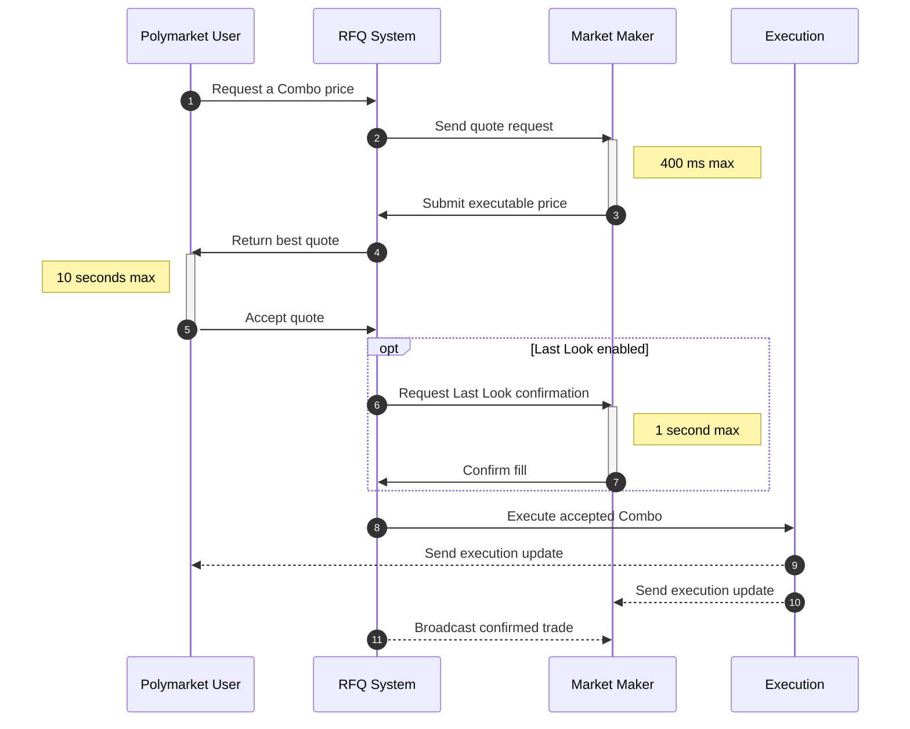

> ## Documentation Index
> Fetch the complete documentation index at: https://docs.polymarket.com/llms.txt
> Use this file to discover all available pages before exploring further.

# Combos 的运作方式

> 了解多腿市场的 Combo 持仓和 RFQ 流程

Combos 是一种多腿持仓，将多个底层市场结果组合成一个 YES 或 NO 持仓。每个 Combo 由其组成腿定义，并通过派生的 YES 和 NO position ID 标识。

询价（RFQ）系统支持两个参与方之间基于报价执行 Combo：Polymarket 用户（询价方）和做市商（报价方）。用户创建 Request，向已连接的做市商发起竞价。做市商提交 Quote 参与竞争，即提供其愿意成交的可执行价格。

1. **用户创建未签名的 Request**，请求 Combo 价格。
2. **RFQ 系统将 Request 发送给**已连接的做市商。
3. **做市商在 400 毫秒的提交窗口内提交已签名的 Quote**。
4. **RFQ 系统将最佳 Quote 返回给用户**。
5. **用户在 10 秒的接受窗口内签署交易，以接受 Quote**。
6. **启用 Last Look 时，RFQ 系统请求 Last Look 确认**。
7. **做市商在 1 秒的确认窗口内确认或拒绝**。
8. **RFQ 系统执行已接受的 Combo**。
9. **用户收到执行更新**。
10. **做市商收到执行更新**。
11. **已连接的做市商收到已确认交易的广播**。

<Note>
  Combo position ID 与 CLOB token ID 相互补充。用户既可以在 CLOB
  上交易市场，也可以将该市场作为 Combo 的一条腿。
</Note>

## 使用 Combos 构建

将 Combos 集成到做市系统或请求可执行价格的应用中。

<CardGroup cols={2}>
  <Card title="做市商" icon="chart-line" href="/cn/trading/combos/market-makers">
    构建用于定价和执行 Combos 的做市商集成。
  </Card>

  <Card title="询价方" icon="arrows-rotate">
    <Badge color="gray" size="sm" shape="pill">即将推出</Badge>

    请求 Combo 报价并执行已接受的交易。
  </Card>
</CardGroup>
